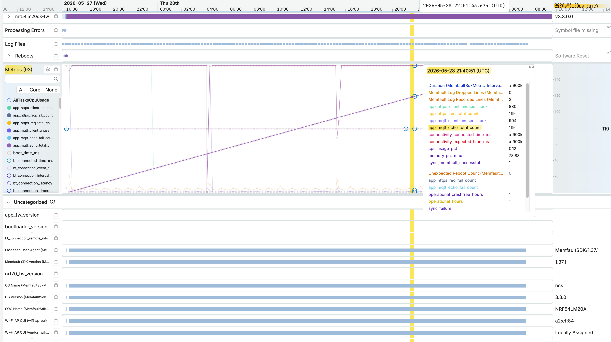

# Nordic Wi-Fi Memfault

[](https://github.com/chshzh/nordic-wifi-memfault/actions/workflows/validation.yml)
[](https://github.com/chshzh/nordic-wifi-memfault/releases/latest)

## What's New since v3.3.0.0

- **NCS v3.3.0 base with Device Tree partitioning** — the application now targets Nordic SDK v3.3.0 and has been migrated from the deprecated Partition Manager to Device Tree-based flash partitioning, aligning with Nordic's current and future toolchain direction.
- **nRF54LM20DK + nRF7002EB2 formally supported** — the nRF54LM20A SoC provides 1984 KB RRAM and 511 KB RAM compared to 1024 KB flash and 448 KB RAM on the nRF5340 (nRF7002DK), offering approximately twice the code storage headroom for future feature growth.
- **BLE provisioning: 2M PHY removed** — the Wi-Fi provisioning over BLE module now operates in 1M PHY mode only; 2M mode has been removed to avoid potential compatibility issues with mobile devices that have inconsistent Bluetooth LE 2M PHY support.
- **Enhanced disconnect diagnostics** — three independent recording layers (Wi-Fi driver, network stack, and Memfault) capture each disconnection event; the Memfault log snapshot and nRF70 firmware statistics (CDR data) are persisted to two new dedicated external flash partitions and automatically uploaded to Memfault on the next successful reconnect.
- **NTP time synchronization** — the device syncs its clock from `pool.ntp.org` after gaining network access; log lines and heartbeat metrics in the Memfault cloud now show the real UTC time the event was captured, not the time the data was uploaded.
- **Full reflash required to upgrade to v3.3.0** — the migration from Partition Manager to Device Tree-based partitioning removes the `mcuboot_pad` region and adds two new external flash partitions, shifting the application start address; OTA from a 3.2 PM-era firmware is not supported. Flash the full `v3.3.0.0` image directly to the device first, then apply subsequent updates (e.g. `v3.3.0.1`) via Memfault OTA as normal.

---

## Project Overview

### Introduction

Nordic Wi-Fi Memfault is a reference application for integrating Memfault observability
with Nordic Wi-Fi hardware. It demonstrates Wi-Fi connectivity, BLE provisioning,
Memfault metrics and crash reporting, and OTA-trigger flows in a modular NCS design.

The application is centered on STA connectivity and event-driven modules that publish
or subscribe through zbus channels.

### Supported hardware

| Board | Build target |
|-------|--------------|
| nRF54LM20DK + nRF7002EB2 | `nrf54lm20dk/nrf54lm20a/cpuapp` + `-DSHIELD=nrf7002eb2` |
| nRF7002DK | `nrf7002dk/nrf5340/cpuapp` |

### Features

- Wi-Fi STA connection lifecycle with reconnect handling and multi-AP credential rotation (retries cycle through all stored networks when the first AP is unavailable)
- BLE Wi-Fi credential provisioning (nRF Wi-Fi Provisioner)
- Memfault heartbeat, metrics, coredump reporting, and OTA checks
- Disconnect-time debug capture — Memfault log ring-buffer and nRF70 CDR firmware statistics are persisted to external flash on connectivity loss, then restored and uploaded on the next reconnect; pre-disconnect logs retain original wall-clock timestamps and a visual separator marks the boundary in the Memfault cloud log view
- Button-driven validation paths (heartbeat/CDR, OTA check, crash demos); button input provided by standalone **[zego/button](../zego/button)** module
- LED Wi-Fi state feedback on LED 0: ROTATE while connecting, solid ON when connected, fast BLINK on error; provided by **[zego/led](../zego/led)** + local UX module
- NTP time synchronization — syncs system clock from `pool.ntp.org` after network ready; log timestamps show real-world UTC time (e.g. `[2026-05-14 19:34:52.299,000]`)
- Optional HTTPS periodic test module
- Optional MQTT periodic pub/sub echo test module
- Heap and thread watermark monitoring via **[zego/memonitor](../zego/bricks/memonitor)** — samples all `k_heap` instances (including mbedTLS), all thread stack HWMs, and publishes to Memfault heartbeat metrics every 5 s; ZView live view enabled via `ZEGO_MEMONITOR_ZVIEW=y`
- Modular architecture based on SYS_INIT + zbus

### Target Users

- **Evaluator** - flash release firmware and validate logs/events quickly, follow the [Evaluator Quick Start](#evaluator-quick-start) guide.
- **Developer** - build from source and modify modules/config, see [Developer Guide](#developer-guide) for build setup and [Documentation](#documentation) for product requirements, architecture, and per-module specs.

---

## Evaluator Quick Start

### Step 1 - Flash the firmware

Download pre-built firmware from the [Latest release](https://github.com/chshzh/nordic-wifi-memfault/releases/latest) page.

Each release provides three artifacts per board and Memfault project:

| Artifact | Purpose |
|----------|---------|
| `*.hex` | Full board image (MCUboot + app) — for initial or recovery flash |
| `*.signed.bin` | MCUboot-signed OTA payload — for over-the-air update via Memfault |
| `*.elf` | Symbol file — upload to Memfault for coredump and crash decoding |

**Option A — Direct flash (initial provisioning or recovery)**

Flash the `.hex` using [nRF Connect for Desktop Programmer](https://www.nordicsemi.com/Products/Development-tools/nRF-Connect-for-Desktop) or via CLI:

```sh
nrfutil device program --firmware <*.hex> --verify
```

**Option B — OTA via Memfault**

Upload the `.signed.bin` to your Memfault project as a new software version, create an OTA release, and deploy it to your device cohort. The device downloads and applies the update automatically on the next OTA check (periodic or button-triggered).

See [Creating a Release and Deploying OTA](https://docs.memfault.com/docs/platform/ota/).

**Symbol file upload**

Upload the `.elf` to your Memfault project to enable coredump decoding and crash analysis.

See [Uploading Symbol Files](https://docs.memfault.com/docs/mcu/symbol-file-build-ids/).

---

Pre-built firmware is only available for approved custom Memfault projects because
project keys are project-specific. If your project is not listed below, it is not
currently supported for evaluator pre-built access.

| Supported project | Release artifact prefix | Status |
|-------------------|-------------------------|--------|
| nordic-test | `nord_project_*` | Supported |

For evaluation access to additional projects, contact charlie.shao@nordicsemi.no
or local Nordic Sales team. Alternatively, follow the Developer path and configure
your own memfault project key to build the firmware.

### Step 2 - Provision Wi-Fi over Bluetooth LE

Provision Wi-Fi credentials with [nRF Wi-Fi Provisioner app](https://www.nordicsemi.com/Products/Development-tools/nRF-Wi-Fi-Provisioner).

### Step 3 - Verify runtime behavior

Monitor logs via UART:

| Board | Port | Baud |
|-------|------|------|
| nRF54LM20DK + nRF7002EB2 | VCOM0 (`/dev/tty.usbmodem*1`) | 115200 |
| nRF7002DK | VCOM1 (`/dev/tty.usbmodem*3`) | 115200 |

Use serial terminal at `115200` and verify:
- boot banner and enabled module list,
- Wi-Fi connect/network-ready logs,
- Memfault upload or heartbeat trigger logs.

Explore your device behavior in [Memfault Cloud](https://app.memfault.com/) after
the device connects and begins uploading data. Check the device logs and heartbeat
metrics from its timeline to monitor connectivity, reboot reasons, and sensor health.




---

## Buttons

| Board | Button | Press | Action |
|-------|--------|-------|--------|
| nRF54LM20DK + nRF7002EB2 | BUTTON0 | short(<3s) | Trigger heartbeat and optional nRF70 CDR |
| nRF54LM20DK + nRF7002EB2 | BUTTON0 | long(>=3s) | Stack overflow demo crash |
| nRF54LM20DK + nRF7002EB2 | BUTTON1 | short(<3s) | Trigger OTA check |
| nRF54LM20DK + nRF7002EB2 | BUTTON1 | long(>=3s) | Division-by-zero demo crash |
| nRF7002DK | Button 1 | short(<3s) | Trigger heartbeat and optional nRF70 CDR |
| nRF7002DK | Button 1 | long(>=3s) | Stack overflow demo crash |
| nRF7002DK | Button 2 | short(<3s) | Trigger OTA check |
| nRF7002DK | Button 2 | long(>=3s) | Division-by-zero demo crash |
---

## Developer Guide

### Project Structure

```text
nordic-wifi-memfault/
├── CMakeLists.txt          ← registers zego bricks via EXTRA_ZEPHYR_MODULES
├── Kconfig
├── prj.conf
├── west.yml
├── boards/                 ← per-board Kconfig fragments (button count, LED count)
├── docs/
│   ├── pm-prd/
│   │   └── PRD.md
│   ├── dev-specs/
│   │   ├── 0-overview.md
│   │   ├── 1-architecture.md
│   │   ├── 2-dts-partition.md
│   │   ├── 3-memopt.md
│   │   ├── network-module.md
│   │   ├── memonitor-module.md
│   │   ├── app-memfault-module.md
│   │   ├── app-https-client-module.md
│   │   ├── app-mqtt-client-module.md
│   │   ├── ntp-module.md
│   │   └── ux.md
│   └── qa-test/
│       └── QA-*.md
├── src/
│   ├── main.c
│   └── modules/
│       ├── network/
│       ├── app_memfault/
│       ├── app_https_client/
│       ├── app_mqtt_client/
│       ├── ntp/
│       └── messages.h
├── overlay-app-memfault-project-info.conf.template
└── .github/workflows/build.yml

# External Zephyr modules (sibling repo — ../zego/)
../zego/button/             ← gesture detection, BUTTON_CHAN; registered via EXTRA_ZEPHYR_MODULES
../zego/led/                ← LED control, LED_CMD_CHAN; registered via EXTRA_ZEPHYR_MODULES
../zego/memonitor/          ← heap + thread watermark sampler, MEMONITOR_CHAN; replaces heap_monitor
```

### Workspace Setup

West workspace is driven by [west.yml](west.yml). Which contains the ncs version this application based on, for example, the following content means ncs v3.3.0.

```sh
    - name: sdk-nrf
      path: nrf
      revision: v3.3.0
      import: true
      remote: ncs
```

Release versions follow the NCS version with a build counter suffix: `v<ncs-version>.<build>` (e.g. `v3.3.0.1`, `v3.3.0.2`). The major/minor/patch components always match the NCS version the firmware is based on, making it easy to identify which SDK a given release targets.

Use nRF Connect for VS Code or a shell initialized with the NCS toolchain.

#### Method 1 (Preferred) — Add to an existing NCS installation

If you already have a matching NCS version installed, reuse it directly — no re-downloading required.

```sh
cd /opt/nordic/ncs/<ncs-version>   # your existing NCS workspace root

git clone https://github.com/chshzh/nordic-wifi-memfault.git

# Switch the workspace manifest to nordic-wifi-memfault (one-time change)
west config manifest.path nordic-wifi-memfault

# Sync — NCS repos already present, only new project repos are cloned
west update
```

#### Method 2 — Fresh installation as a Workspace Application

##### Option A: nRF Connect for VS Code

Follow the [custom repository guide](https://docs.nordicsemi.com/bundle/nrf-connect-vscode/page/guides/extension_custom_repo.html).

##### Option B: CLI

```sh
west init -m https://github.com/chshzh/nordic-wifi-memfault --mr main <workspace-dir>
cd <workspace-dir>
west update
```

See the Nordic guide on [Workspace Application Setup](https://docs.nordicsemi.com/bundle/ncs-latest/page/nrf/dev_model_and_contributions/adding_code.html#workflow_4_workspace_application_repository_recommended) for details.

### Build
Fill `overlay-app-memfault-project-info.conf` with your memfault project key and fw version.

```bash
# nRF54LM20DK + nRF7002EB2
west build -p -b nrf54lm20dk/nrf54lm20a/cpuapp -d build_nrf54lm20dk -- \
  -DSHIELD=nrf7002eb2 \
  -DEXTRA_CONF_FILE="overlay-app-memfault-project-info.conf"

# nRF7002DK
west build -p -b nrf7002dk/nrf5340/cpuapp -d build_nrf7002dk -- \
  -DEXTRA_CONF_FILE="overlay-app-memfault-project-info.conf"
```

### Flash

**First-time flash** (erases all flash including NVS — Wi-Fi credentials will need to be re-provisioned):

```bash
# nRF54LM20DK
west flash -d build_nrf54lm20dk --recover

# nRF7002DK
west flash -d build_nrf7002dk --erase
```

**Subsequent updates** (preserves NVS — Wi-Fi credentials are retained, no re-provisioning needed):

```bash
# nRF54LM20DK
west flash -d build_nrf54lm20dk

# nRF7002DK
west flash -d build_nrf7002dk
```

### Developer Notes

#### General

- Board-specific Kconfig overrides are in `boards/*.conf` (both nRF54LM20DK and nRF7002DK).
- Partition Manager (PM) is deprecated in NCS v3.3.0 and will be removed by end of 2026. This project was migrated to DTS-based partitioning: flash layouts are defined in `boards/<board>.overlay`, MCUboot shares the same map via `sysbuild/mcuboot/boards/<board>.overlay` (which `#include`s the app overlay), and PM is disabled with `SB_CONFIG_PARTITION_MANAGER=n` in `sysbuild.conf`. If DFU is active in the field from a PM-era firmware, the new DTS partition addresses **must** match the old `pm_static.yml` addresses exactly — address mismatch prevents MCUboot from validating the upgrade image.
- nRF7002DK uses a custom flash coredump backend (`CONFIG_MEMFAULT_COREDUMP_STORAGE_CUSTOM=y`) in `src/modules/app_memfault/core/memfault_flash_coredump_storage.c` to bypass the upstream `PARTITION_MANAGER_ENABLED` dependency in `CONFIG_MEMFAULT_NCS_INTERNAL_FLASH_BACKED_COREDUMP`.

#### Storage Architecture

Only coredumps are written to non-volatile storage and survive a reset. All other Memfault data lives in RAM and must be uploaded before a power cycle.

| Data | Kconfig | Storage | Volatile? |
|------|---------|---------|-----------|
| Coredump (nRF54LM20DK) | `CONFIG_MEMFAULT_COREDUMP_STORAGE_RRAM=y` | RRAM partition `memfault_coredump_partition` (64 KB at `0x1d5000`) | No — survives power cycle |
| Coredump (nRF7002DK) | `CONFIG_MEMFAULT_COREDUMP_STORAGE_CUSTOM=y` | Flash partition `memfault_storage` (64 KB at `0xf0000`) | No — survives power cycle |
| Heartbeat / trace events | `CONFIG_MEMFAULT_EVENT_STORAGE_SIZE=4096` | RAM ring buffer | Yes — lost on hard reset |
| Log file | `CONFIG_MEMFAULT_LOGGING_RAM_SIZE=8192` | RAM circular buffer; disconnect-time snapshot persisted to external flash (`mflt-log-state`, 12 KB on mx25r64) when `CONFIG_APP_MEMFAULT_LOG_STATE_RESTORE=y` | Conditionally no — survives power cycle via external flash restore on next reconnect |
| CDR (nRF70 FW stats) | `CONFIG_NRF70_FW_STATS_CDR_ENABLED=y` | Static RAM buffer (up to 1 KB) | Yes — lost on reboot before upload |

#### Free-Tier Rate Limits

| Feature | Free-tier limit | Rate at current config | Controlling config |
|---|---|---|---|
| Heartbeats | 100/day | 96/day (15 min interval) | `MEMFAULT_METRICS_HEARTBEAT_INTERVAL_SECS=900` |
| Log files | 150/day, 1000/7-day | 96/day (piggybacks on upload interval) | `MEMFAULT_HTTP_PERIODIC_UPLOAD_INTERVAL_SECS=900` |
| OTA checks | 100/day | 24/day (60 min interval) | `MEMFAULT_OTA_CHECK_INTERVAL_MIN=60` |
| CDR | 1/day | On-demand (button press) | `NRF70_FW_STATS_CDR_ENABLED=y` — no firmware throttle |
| Coredumps | 24/day | Crash-triggered | N/A |
| Trace events | 100/day | Button-triggered | N/A |
| Reboot events | 100/day, 1400/14-day | Reset-triggered | N/A |
| Sessions | 16/day | 0 (not used) | N/A |

#### Live Memory and Thread Watermark Monitoring with ZView

Run ZView from the project root while the board is live. Replace the `-s` serial with your board's J-Link serial number (`nrfjprog --ids`).

**nRF54LM20DK + nRF7002EB2:**
```bash
west zview live \
  -e build_nrf54lm20dk/nordic-wifi-memfault/zephyr/zephyr.elf \
  -r jlink \
  -t nRF54LM20A_M33 \
  -s 1051869687
```

**nRF7002DK:**
```bash
west zview live \
  -e build_nrf7002dk/nordic-wifi-memfault/zephyr/zephyr.elf \
  -r jlink \
  -t nRF5340_xxAA \
  -s 1050793110
```
Targets the application core (M33); the network core runs `hci_ipc` which has no Zephyr kernel objects to monitor.

**How to get representative watermarks:** Exercise the full connectivity and upload cycle in one session before reading peak values. A typical sequence:
1. Boot → Wi-Fi connects (STA) → DHCP completes
2. Short-press BUTTON0 → triggers heartbeat + CDR upload
3. Short-press BUTTON1 → triggers OTA check
4. Power off the AP (or run `wifi disconnect`) → observe disconnect capture; restore AP → observe reconnect and log restore upload
5. Long-press BUTTON0 → stack overflow coredump; reflash and reconnect

ZView accumulates **high-water marks** (HWM) across the session — the peaks shown after this cycle represent worst-case usage for the STA + Memfault upload path.

**Key threads to watch on nRF7002DK (nRF54LM20DK values are higher due to BLE):**

| Thread | Expected HWM | Note |
|---|---|---|
| `hostap_handler` | ~7500 / 8304 (90 %) | High by design — drives WPA supplicant. Monitor for growth across firmware versions. |
| `hostap_iface_wq` | ~3552 / 3952 (90 %) | WPA supplicant work queue. Stable. |
| `nrf70_bh_wq` | ~1168 / 1304 (90 %) | nRF70 bottom half. Peaks at connect/disconnect. |
| `sysworkq` | ~3800 / 5072 | Peaks during Memfault HTTP upload. |
| `net_mgmt` | ~2536 / 3272 (STA peak) | Peaks during DHCP. |
| `net_socket_service` | ~1960 / 2400 | Peaks during HTTPS/Memfault upload. |

**Key heaps on nRF54LM20DK:**

| Heap | Peak condition | HWM observed |
|---|---|---|
| `_system_heap` | STA connected + Memfault upload in flight | ~66 KB / 110 KB |
| `_system_heap` | Disconnect-time log snapshot write to external flash | ~70 KB / 110 KB |

**Memory sizing rules** — read HWM after the full cycle above:

*Thread stacks:*
- Resize if HWM > **80 %** of allocated stack size.
- For large, well-characterised stacks (> 2048 B) — `hostap_handler`, `hostap_iface_wq`, `nrf70_bh_wq` — the practical threshold is **90 %**; these sit at 85–90 % by design and are stable.
- Sizing formula: `CONFIG_<THREAD>_STACK_SIZE = HWM / 0.9` (≈ 10 % headroom).

*System heap:*
- Resize if heap HWM > **80 %** of total heap size.
- Sizing formula: `CONFIG_HEAP_MEM_POOL_SIZE = HWM / 0.8` (≈ 20 % headroom).

Update `prj.conf` or `boards/*.conf` with new measurements after each firmware change that touches network or Memfault upload paths.

#### NTP Clock and Timeline Timestamps

The device uses the Nordic `date_time` library (fed by SNTP) as the UTC time source for all Memfault timestamps. If NTP has not yet synced when an event is recorded, no device timestamp is embedded and the Memfault server falls back to the HTTP receive time for display.

At 40 ppm crystal drift the device re-syncs every 6 hours (`CONFIG_NTP_RESYNC_INTERVAL_SEC=21600`), keeping timestamp error ≤ 0.86 s. Adjust for tighter or looser requirements (3 h → ≤ 0.43 s, 12 h → ≤ 1.73 s).

| Data | When the timestamp is captured | What it means on the Memfault timeline | If NTP not yet synced |
|---|---|---|---|
| Log lines | When the log line is written to the Memfault RAM buffer — not at upload | UTC time the device emitted the log | Server uses HTTP receive time |
| Heartbeat metrics | When the 900 s window closes and `memfault_metrics_heartbeat_serialize` runs — not when individual metric values were set during the window | UTC time the measurement window ended | Server uses HTTP receive time |

## Documentation

Start with [docs/dev-specs/0-overview.md](docs/dev-specs/0-overview.md).

| Document | Description |
|---|---|
| [docs/pm-prd/PRD.md](docs/pm-prd/PRD.md) | Product requirements and acceptance criteria |
| [docs/dev-specs/0-overview.md](docs/dev-specs/0-overview.md) | Spec index and PRD-to-spec mapping |
| [docs/dev-specs/1-architecture.md](docs/dev-specs/1-architecture.md) | System architecture and channel flow |
| [docs/dev-specs/2-dts-partition.md](docs/dev-specs/2-dts-partition.md) | Flash/partition layouts, PM-to-DTS migration rationale, OTA compatibility limits |
| [docs/dev-specs/3-memopt.md](docs/dev-specs/3-memopt.md) | Memory optimization report — thread stack watermarks, heap budget, sizing history |
| [zego/button ↗](https://github.com/chshzh/zego/blob/main/bricks/button/docs/button-spec.md) | Button module — gesture detection (click, double-click, long press), Zbus `BUTTON_CHAN`; provided by **zego/button** |
| [zego/led ↗](https://github.com/chshzh/zego/blob/main/bricks/led/docs/led-spec.md) | LED module — per-LED state machine (static, blink, breathe, rotate), Zbus `LED_CMD_CHAN`; provided by **zego/led** |
| [docs/dev-specs/network-module.md](docs/dev-specs/network-module.md) | Wi-Fi/network event lifecycle |
| [zego/wifi_ble_prov ↗](https://github.com/chshzh/zego/blob/main/modules/wifi_ble_prov/docs/wifi-ble-prov-spec.md) | BLE provisioning wrapper; provided by **zego/wifi_ble_prov** |
| [docs/dev-specs/memonitor-module.md](docs/dev-specs/memonitor-module.md) | Heap + thread watermark monitoring, ZView, Memfault metric feed |
| [docs/dev-specs/app-memfault-module.md](docs/dev-specs/app-memfault-module.md) | Memfault integration wrapper |
| [docs/dev-specs/app-https-client-module.md](docs/dev-specs/app-https-client-module.md) | HTTPS module behavior |
| [docs/dev-specs/app-mqtt-client-module.md](docs/dev-specs/app-mqtt-client-module.md) | MQTT module behavior |
| [docs/dev-specs/ntp-module.md](docs/dev-specs/ntp-module.md) | NTP time synchronization — SNTP client, system clock set, UTC log timestamps |
| [docs/qa-test/README.md](docs/qa-test/README.md) | QA snapshot folder conventions |

## Methodology

Developed with [chsh-sk-ncs-0-workflow](https://github.com/chshzh/claude/blob/main/skills/chsh-sk-ncs-0-workflow/SKILL.md) — a four-phase PRD → Specs → Implementation → V&V lifecycle for NCS/Zephyr IoT projects.

---

## License

[SPDX-License-Identifier: LicenseRef-Nordic-5-Clause](LICENSE)
