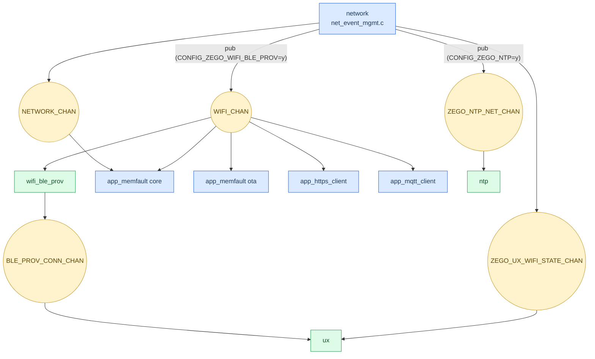
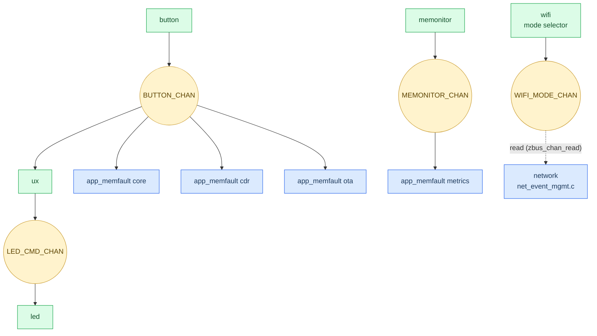

# System Architecture Specification - nordic-wifi-memfault

## Document Information

| Field | Value |
|-------|-------|
| Project | nordic-wifi-memfault |
| Version | 2026-07-08-00-02 |
| PRD Version | 2026-07-07-16-32 |
| NCS Version | v3.4.0 |
| Target Board(s) | nRF54LM20DK + nRF7002EB2, nRF7002DK |
| Status | Implemented |

---

## Changelog

| Version | Summary of changes |
|---|---|
| 2026-07-08-00-02 | Moved `src/modules/ntp/` to `zego/bricks/ntp/` as a first-class zego brick (also adopted by `zego/nordic-wifi-app-template`). `CONFIG_NTP_MODULE`/`CONFIG_NTP_*` → `CONFIG_ZEGO_NTP`/`CONFIG_ZEGO_NTP_*`. `net_event_mgmt.c` now also publishes `ZEGO_NTP_NET_CHAN` alongside `NETWORK_CHAN`/`WIFI_CHAN`/`ZEGO_UX_WIFI_STATE_CHAN`. See [ntp-module.md](ntp-module.md). |
|---|---|
| 2026-07-08-00-01 | Re-introduced `src/modules/ux/ux.c` (`CONFIG_ZEGO_UX`) in the Module Map \u2014 overrides zego/ux's `__weak` Button 0 single-click/long-press hooks only (LED feedback still owned by `zego/bricks/ux`). See [4-ux.md](4-ux.md). |
| 2026-07-08-00-00 | Added Zbus Subscription/Publish Diagrams (Mermaid) under Zbus Channels, derived from `ZBUS_CHAN_DEFINE`/`ZBUS_CHAN_ADD_OBS`/`zbus_chan_pub` call sites across `src/modules/` and `zego/bricks/`. Split into a connectivity-flow diagram and an input/LED/telemetry-flow diagram (top-down layout, color-coded by module origin) after the combined single-diagram version proved too cluttered to read. |
| 2026-07-07-16-32 | PRD Version updated to 2026-07-07-16-32. Removed `src/modules/ux/` (`APP_UX_MODULE`) — superseded by `zego/bricks/ux`, which already provides identical LED 0 Wi-Fi-state feedback and was linked in for the startup banner (both were independently driving LED 0). `net_event_app.c` (renamed `net_event_mgmt.c`) now publishes `ZEGO_UX_WIFI_STATE_CHAN` instead of the removed `APP_WIFI_STATE_CHAN`; `messages.h` no longer defines `app_wifi_state_msg`. See [4-ux.md](4-ux.md). |
| 2026-06-19-12-44 | PRD Version updated to 2026-06-19-12-31. |
| 2026-06-05-10-20 | Verification P1 fix: added APP_WIFI_STATE_CHAN and LED_CMD_CHAN to Zbus channel table and message definitions; updated Boot Sequence with ux module. |
| 2026-06-04-23-33 | Version and PRD Version updated to track latest PRD (2026-06-04-23-04). |
| 2026-05-14-14-13 | Reverse-design architecture baseline generated from implementation |
| 2026-05-15-10-31 | Add app_memfault core as NETWORK_CHAN subscriber |
| 2026-06-04-23-00 | Add zego/led + ux module; update module map to show all zego external modules; add APP_WIFI_STATE_CHAN |

---

## Overview

Application architecture is modular and event-driven. Modules initialize through
SYS_INIT and communicate through zbus channels using shared message types from
src/modules/messages.h. Connectivity and cloud interactions are implemented as
wrappers around Zephyr/NCS subsystems and Memfault SDK APIs.

Scope note: this architecture governs application modules only. External SDKs
(Memfault, Wi-Fi driver, BLE provisioning internals, TLS stack) may run their
own internal threads.

---

## Module Map

```
# App-owned modules (src/modules/)
src/
├── main.c
└── modules/
    ├── messages.h          ← app-local Zbus types (network_msg)
    ├── network/            ← net_event_mgmt.c: NETWORK_CHAN + WIFI_CHAN + ZEGO_UX_WIFI_STATE_CHAN
    ├── ux/                 ← overrides zego/ux's __weak Button 0 single-click/long-press hooks only (LED feedback still owned by zego/ux)
    ├── heap_monitor/       ← heap telemetry → Memfault metrics
    ├── app_memfault/       ← Memfault core, metrics, OTA triggers, CDR
    ├── app_https_client/   ← HTTPS health-check client (nRF54LM20DK only)
    └── app_mqtt_client/    ← MQTT echo client

# External zego modules (registered via EXTRA_ZEPHYR_MODULES in CMakeLists.txt)
../zego/modules/
    ├── button/             ← publishes BUTTON_CHAN (CONFIG_ZEGO_BUTTON=y)
    ├── led/                ← consumes LED_CMD_CHAN (CONFIG_ZEGO_LED=y)
    ├── wifi/               ← mode selector, startup banner
    ├── network/            ← Wi-Fi event backbone (zego_network_on_* weak hooks)
    ├── ux/                 ← LED 0 state machine + Button 0 gesture hooks (two hooks overridden locally - see src/modules/ux/)
    ├── ntp/                ← SNTP time synchronization (CONFIG_ZEGO_NTP=y); subscribes ZEGO_NTP_NET_CHAN, published from src/modules/network/net_event_mgmt.c
    └── wifi_ble_prov/      ← BLE Wi-Fi provisioning (CONFIG_ZEGO_WIFI_BLE_PROV=y)

Note: src/modules/wifi_prov_over_ble/ is a legacy stale directory; it is not compiled
      (no add_subdirectory in CMakeLists.txt). BLE provisioning is handled by zego/wifi_ble_prov.
```

---

## Zbus Channels

| Channel | Message Type | Publisher | Subscribers | Direction |
|---------|-------------|-----------|-------------|-----------|
| BUTTON_CHAN | struct button_msg | zego/button (external) | app_memfault core, app_memfault ota, app_memfault cdr | runtime |
| WIFI_CHAN | struct wifi_msg | network module | app_memfault core, app_memfault ota, wifi_prov_over_ble, app_https_client, app_mqtt_client | runtime |
| NETWORK_CHAN | struct network_msg | network module | app_memfault core | runtime |
| ZEGO_UX_WIFI_STATE_CHAN | struct zego_ux_wifi_state_msg | network module (net_event_mgmt.c) | zego/ux (external) | runtime |
| ZEGO_NTP_NET_CHAN | struct zego_ntp_net_msg | network module (net_event_mgmt.c) | zego/ntp (external, optional) | runtime |

### Message Definitions

```c
enum button_msg_type {
    BUTTON_PRESSED,       /* raw press — duration_ms = 0 */
    BUTTON_RELEASED,      /* raw release — duration_ms = hold time in ms */
    BUTTON_SINGLE_CLICK,  /* confirmed single press (after double-click window) */
    BUTTON_DOUBLE_CLICK,  /* two presses within DOUBLE_CLICK_WINDOW_MS */
    BUTTON_LONG_PRESS,    /* held >= LONG_PRESS_MS (published while still held) */
};
struct button_msg {
    enum button_msg_type type;
    uint8_t button_number;
    uint32_t duration_ms;
    uint32_t press_count;
    uint32_t timestamp;
};

enum wifi_msg_type {
    WIFI_STA_CONNECTED,
    WIFI_STA_DISCONNECTED,
    WIFI_DNS_READY,
    WIFI_ERROR,
};
struct wifi_msg {
    enum wifi_msg_type type;
    int32_t rssi;
    int error_code;
};

enum network_msg_type { NETWORK_READY, NETWORK_NOT_READY };
struct network_msg {
    enum network_msg_type type;
    bool ready;
};

/* zego_ux_wifi_state_msg defined in zego/bricks/ux/src/ux.h */
/* zego_ntp_net_msg defined in zego/bricks/ntp/src/ntp.h */
```

### Zbus Subscription/Publish Diagrams

Derived directly from `ZBUS_CHAN_DEFINE` / `ZBUS_CHAN_ADD_OBS` / `zbus_chan_pub` call sites in
`src/modules/**` and `../zego/bricks/**`. Split into two diagrams by concern (connectivity vs.
input/UX/telemetry) to keep each one readable — the combined graph has too many crossing edges.
Layout is top-down: publishers rank above the channel they publish to, subscribers rank below it.
🟦 blue = app module (`src/modules/`), 🟩 green = zego brick (external), 🟨 yellow = zbus channel.
Dashed arrow = direct `zbus_chan_read()` (no listener registered), not a subscription.

#### Connectivity event flow



#### Input / LED / telemetry flow



Notes:
- `WIFI_CHAN` and `BLE_PROV_CONN_CHAN` are defined in `zego/bricks/wifi_ble_prov/src/wifi_ble_prov.c`, not in the app; the app's `network` module only publishes onto `WIFI_CHAN` (weak-hook override), gated by `CONFIG_ZEGO_WIFI_BLE_PROV`.
- `LED_STATE_CHAN` (defined in `zego/bricks/led`) has no production subscriber (sample app only) and is omitted above.
- `WIFI_MODE_CHAN` is not observer-based: `network` reads it once via `zbus_chan_read()` at boot to pick SoftAP/STA/P2P startup, rather than subscribing to it.
- `network` and `app_memfault core`/`ota` appear in both diagrams since they participate in both concerns.

---

## External Libraries

| Library | NCS Kconfig | Internal threads | App wrapper module |
|---------|-------------|------------------|--------------------|
| Memfault SDK | CONFIG_MEMFAULT | Memfault HTTP/FOTA worker threads | app_memfault/ |
| Wi-Fi Provisioning Service | CONFIG_BT_WIFI_PROV | BLE/controller workqueues | wifi_prov_over_ble/ |
| MQTT Helper | CONFIG_MQTT_HELPER | Helper-managed MQTT context threads | app_mqtt_client/ |

---

## Boot Sequence

| Priority | Module | SYS_INIT call | UART marker |
|----------|--------|---------------|-------------|
| 90 (default) | network | init_network_events | [wifi] WiFi module initialized |
| default app init prio | zego/button (external) | `zego_button_init` (SYS_INIT) | [button] initialized |
| default kernel init prio | heap_monitor | heap_monitor_init | [heap_monitor] enabled |
| default app init prio | app_memfault core | memfault_core_init | [app_memfault] initialized |
| 2 | app_https_client | app_https_client_module_init | [app_https_client] initialized |
| 2 | app_mqtt_client | app_mqtt_client_module_init | [app_mqtt_client] initialized |
| 95 | wifi_prov_over_ble | wifi_prov_over_ble_init | [wifi_prov_over_ble] initialized |

---

## Thread Budget

| Thread | Stack symbol | Purpose |
|--------|--------------|---------|
| memfault_upload_tid | CONFIG_MEMFAULT_UPLOAD_THREAD_STACK_SIZE | On-connect DNS wait and upload trigger |
| mflt_ota_triggers_tid | MFLT_OTA_TRIGGERS_THREAD_STACK_SIZE | Periodic and event-triggered OTA check scheduling |
| app_https_client_tid | CONFIG_APP_HTTPS_CLIENT_STACK_SIZE | Periodic HTTPS HEAD requests |
| app_mqtt_client_tid | CONFIG_APP_MQTT_CLIENT_STACK_SIZE | MQTT connect/publish loop |

---

## Memory Budget

| Area | Current note |
|------|--------------|
| Stack tuning | Thread stacks are tuned in prj.conf from measurements (see comments) |
| System heap | CONFIG_HEAP_MEM_POOL_SIZE=72410 with headroom based on measured peak |
| mbedTLS heap | CONFIG_MBEDTLS_HEAP_SIZE=86880 |
| Coredump storage | Board-specific partition in DTS overlays |

For full partition maps, PM-to-DTS migration rationale, and OTA compatibility
constraints, see [partition-layout.md](partition-layout.md).

---

## Test Points

| Stage | UART log expected | Pass condition |
|-------|-------------------|----------------|
| Boot banner | Board/Version/Enabled modules lines from main.c | Appears each boot |
| Connectivity up | WiFi CONNECTED / network ready log | Device has IP and publishes WIFI_CHAN |
| Memfault trigger | Upload or heartbeat logs after connect/button action | Events observed in logs/dashboard |
| Optional clients | HTTPS/MQTT periodic success/fail logs | Metrics counters progress |
