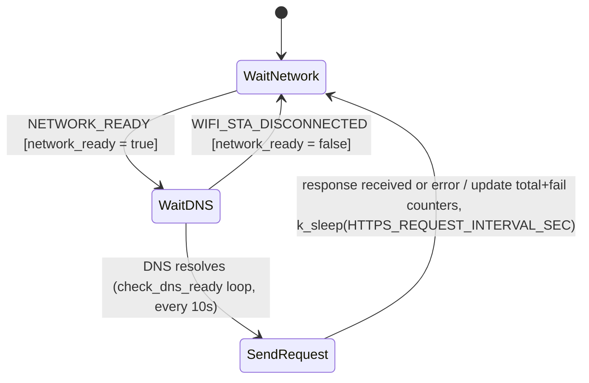

# App HTTPS Client Module Specification

## Document Information

| Field | Value |
|-------|-------|
| Project | nordic-wifi-memfault |
| Version | 2026-08-20-13-20 |
| PRD Version | 2026-08-20-13-20 |
| NCS Version | v2.6.4 |
| Target Board(s) | nRF7002DK |
| Status | Implemented |

> `Version` = this spec's own latest edit time (`date +%Y-%m-%d-%H-%M`); bump it on **every** edit.
> `PRD Version` = the PRD Changelog timestamp this spec tracks. The two normally **differ** — never set them equal.

---

## Changelog

| Version | Summary of changes |
|---|---|
| 2026-08-20-13-20 | **Zbus event redesign**: switched from subscribing to `WIFI_CHAN`'s `WIFI_STA_CONNECTED`/`WIFI_STA_DISCONNECTED` to `NETWORK_CHAN`'s `NETWORK_READY`/`NETWORK_NOT_READY`. See [network-module.md](network-module.md) for the full rationale. |
| 2026-07-13-11-08 | New standalone spec — the legacy `pm/PRD.md` described this as "Module 6" inline but `pm/openspec/specs/` had no dedicated file for it. Reverse-designed from current `app_https_client.c`. |
| 2026-07-24-11-30 | Ported a `DNS_EAI_CANCELED` retry from `nordic-wifi-memfault-main`: `getaddrinfo()` can return `DNS_EAI_CANCELED` (-101) when DHCPv4 lease renewal calls `dns_resolve_reconfigure()` and cancels in-flight DNS queries mid-flight; `send_http_request()` now waits 2 s and retries once, and the error log shows the EAI code alongside `errno` (previously `errno` alone, which is stale/misleading for DNS failures). |
| 2026-08-19-15-30 | Dropped nRF54LM20DK + nRF7002EB II from Target Board(s) — that board has no board definition in NCS v2.6.4 and has been removed project-wide; see `1-architecture.md` Changelog for the full removal. No module-specific behavior changed. |

---

## Overview

Always-on module that sends a periodic HTTPS `HEAD` request to a configured hostname
(default `example.com`) once the network is ready, as a connectivity health check. Reports
success/failure counts as Memfault metrics. Runs entirely in its own dedicated thread; not
gated by any Kconfig demo/mode flag beyond `CONFIG_APP_HTTPS_CLIENT_MODULE`.

---

## Location

- **Path**: `src/modules/app_https_client/`
- **Files**: `app_https_client.c`, `app_https_client.h`, `Kconfig.app_https_client`, `Kconfig.defaults`, `CMakeLists.txt`, `cert/Comodo-AAA-Certificate-Services.pem.inc`

---

## Module Type

- [ ] Application module
- [x] **Library wrapper module** — wraps Zephyr's BSD socket + `tls_credentials` API (no external Kconfig-selected "library" per se, but follows the same wrapper pattern: calls socket/TLS APIs directly and is the app's sole owner of this network flow).

---

## External Library Interface

| Field | Value |
|-------|-------|
| Library | Zephyr BSD sockets + TLS credentials subsystem (`CONFIG_NET_SOCKETS_SOCKOPT_TLS`) |
| NCS Kconfig | `CONFIG_APP_HTTPS_CLIENT_MODULE=y` |
| Library internal threads | None dedicated — this module owns its own thread (`app_https_client_tid`) |

**APIs called by this module** (app → library):

```c
tls_credential_add(...) / modem_key_mgmt_write(...)  /* provision the bundled CA cert (cert_provision()) */
getaddrinfo(CONFIG_APP_HTTPS_HOSTNAME, "443", ...);   /* DNS resolution */
socket(...), setsockopt(fd, SOL_TLS, TLS_HOSTNAME, ...), connect(...), send(...), recv(...);
MEMFAULT_METRIC_SET_UNSIGNED(app_https_req_total_count, ...);
MEMFAULT_METRIC_SET_UNSIGNED(app_https_req_fail_count, ...);
```

**Callbacks implemented by this module**: none — this is a polling/thread-driven client, not
a callback-driven wrapper.

**Zbus integration**:

| Library event | Zbus channel published | Message |
|--------------------------|----------------------|---------|
| none (this module subscribes to `NETWORK_CHAN`, it does not publish) | — | — |

---

## Zbus Integration

**Subscribes to**: `NETWORK_CHAN` — sets `network_ready` on `NETWORK_READY`, clears it on
`NETWORK_NOT_READY`; the client thread only attempts requests while `network_ready` is true.

**Publishes to**: none.

---

## State Machine

Not SMF — single dedicated thread (`app_https_client_tid`) loop:



**State descriptions:**

| State | Description |
|-------|-------------|
| WaitNetwork | Blocked on `https_thread_sem`, given by the `NETWORK_CHAN` listener on connect |
| WaitDNS | Polling `check_dns_ready()` for the configured hostname every 10 s |
| SendRequest | Opens a TLS socket, provisions the CA cert if needed, sends `HTTP_HEAD`, reads the response, updates counters |

---

## Kconfig Flags

| Symbol | Type | Default | Description |
|--------|------|---------|--------------|
| `CONFIG_APP_HTTPS_CLIENT_MODULE` | bool | `n` (enabled via `prj.conf`) | Enable the module |
| `CONFIG_APP_HTTPS_HOSTNAME` | string | `"example.com"` | Target hostname for periodic `HEAD` requests |
| `CONFIG_APP_HTTPS_REQUEST_INTERVAL_SEC` | int (1–86400) | `300` | Interval between requests |
| `CONFIG_APP_HTTPS_CLIENT_STACK_SIZE` | int | `4096` (sized 1.5× a measured 2396 B watermark) | Thread stack size |
| `CONFIG_APP_HTTPS_CLIENT_THREAD_PRIORITY` | int | `5` | Thread priority |
| `CONFIG_APP_HTTPS_CLIENT_LOG_LEVEL_*` | choice | `INF` | Log level (`prj.conf`) |

---

## API / Public Interface

No public functions exported — `app_https_client.h` only declares module-internal types used
by `app_https_client.c`. The module is self-starting via `K_THREAD_DEFINE`.

---

## Error Handling

| Error Condition | Detection | Response |
|----------------|-----------|----------|
| DNS never resolves | `check_dns_ready()` loop | Logs and retries every 10 s (bounded loop with its own timeout inside the function) |
| DNS query canceled mid-flight | `getaddrinfo()` returns `DNS_EAI_CANCELED` (DHCPv4 lease renewal reconfigured the resolver) | Single retry after a 2 s delay in `send_http_request()`; logs both the EAI code and `errno` |
| Cert provisioning fails | Return code from `modem_key_mgmt_write` (only relevant with `CONFIG_MODEM_KEY_MGMT`; not used on this Wi-Fi-only target) or `tls_credential_add` | Logged; request attempt still proceeds and typically fails at TLS handshake, counted as a failure |
| Socket/connect/send/recv failure | Return codes checked at each step | `https_req_failures` incremented; `app_https_req_fail_count` Memfault metric updated |
| Certificate too large | `BUILD_ASSERT(sizeof(cert) < KB(4), ...)` | Compile-time failure, not a runtime condition |

---

## Memory Estimate

| Resource | Value | Notes |
|----------|-------|-------|
| Flash | ~30 KB | Per legacy architecture estimate; not re-measured |
| RAM (static) | ~8 KB | `recv_buf[2048]` + counters + TLS state |
| Stack | 4096 B (`CONFIG_APP_HTTPS_CLIENT_STACK_SIZE`) | Sized 1.5× a measured 2396 B high-water mark |

---

## Test Points

| Scenario | UART log expected | Pass condition |
|----------|-------------------|----------------|
| DNS lookup | `Looking up %s` (hostname) | On each cycle after network ready |
| Successful request | Response received, `app_https_req_total_count` incremented | HTTP HEAD round-trip succeeds |
| Failed request | `app_https_req_fail_count` incremented | Any socket/TLS/DNS failure |

---

## Open Issues / TBD

- [ ] No `range` guard on `CONFIG_APP_HTTPS_REQUEST_INTERVAL_SEC` was flagged in the legacy `pm/QA.md` report (W-04) — **resolved**: current `Kconfig.app_https_client` has `range 1 86400`.

---

## Related Specs

- [network-module.md](network-module.md) — publishes `NETWORK_CHAN`
- [app-memfault-module.md](app-memfault-module.md) — shares the Memfault metrics heartbeat

*(Changelog is maintained at the top of this document.)*
