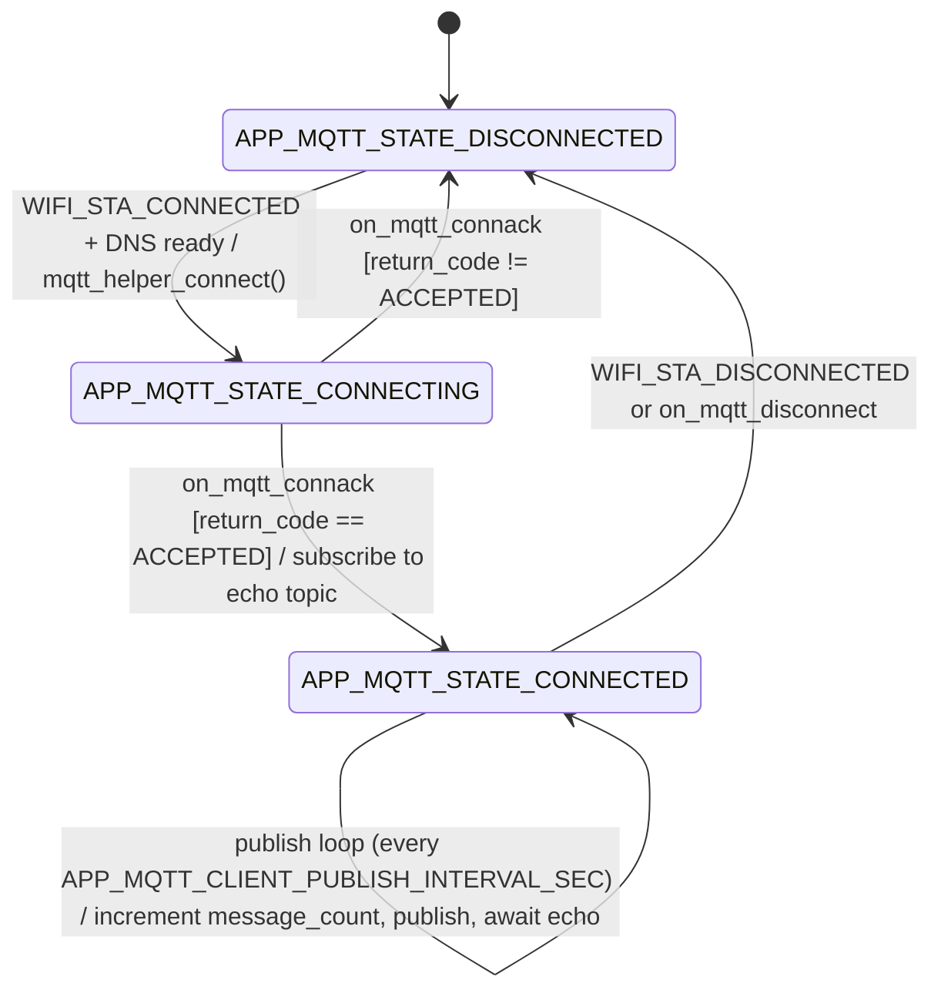

# App MQTT Client Module Specification

## Document Information

| Field | Value |
|-------|-------|
| Project | nordic-wifi-memfault |
| Version | 2026-08-19-15-30 |
| PRD Version | 2026-08-19-15-00 |
| NCS Version | v2.6.4 |
| Target Board(s) | nRF7002DK |
| Status | Implemented |

> `Version` = this spec's own latest edit time (`date +%Y-%m-%d-%H-%M`); bump it on **every** edit.
> `PRD Version` = the PRD Changelog timestamp this spec tracks. The two normally **differ** — never set them equal.

---

## Changelog

| Version | Summary of changes |
|---|---|
| 2026-07-13-11-08 | New standalone spec — legacy `pm/PRD.md` described this as "Module 7" inline (targeting `test.mosquitto.org`) but had no dedicated spec file. Current code targets `broker.emqx.io` (per `Kconfig.defaults` and `prj.conf`) — broker changed since the legacy docs. |
| 2026-08-19-15-30 | Dropped nRF54LM20DK + nRF7002EB II from Target Board(s) — that board has no board definition in NCS v2.6.4 and has been removed project-wide; see `1-architecture.md` Changelog for the full removal. No module-specific behavior changed. |

---

## Overview

Always-on module that maintains a TLS-secured MQTT connection to a broker (default
`broker.emqx.io`), publishes an incrementing counter, and subscribes to the same topic to
verify the message echoes back (round-trip connectivity test). Reports publish/echo
success and failure counts as Memfault metrics.

---

## Location

- **Path**: `src/modules/app_mqtt_client/`
- **Files**: `app_mqtt_client.c`, `app_mqtt_client.h`, `Kconfig.app_mqtt_client`, `Kconfig.defaults`, `CMakeLists.txt`, `cert/`

---

## Module Type

- [ ] Application module
- [x] **Library wrapper module** — wraps the `mqtt_helper` library.

---

## External Library Interface

| Field | Value |
|-------|-------|
| Library | `mqtt_helper` (NCS) |
| NCS Kconfig | `CONFIG_APP_MQTT_CLIENT_MODULE=y` → `select MQTT_HELPER`, `select HW_ID_LIBRARY` |
| Library internal threads | `mqtt_helper` manages its own internal socket/keepalive handling; this module additionally owns its own dedicated thread (`app_mqtt_client_tid`) for the connect/publish loop |

**APIs called by this module** (app → library):

```c
mqtt_helper_init(...);            /* register callbacks (connack, disconnect, publish, etc.) */
mqtt_helper_connect(...);         /* connect using CONFIG_APP_MQTT_CLIENT_BROKER_HOSTNAME + MQTT_HELPER_PORT */
mqtt_helper_subscribe(&sub_list); /* subscribe to the echo topic, QoS 0 */
mqtt_helper_publish(...);         /* publish the counter value */
mqtt_helper_disconnect();
hw_id_get(...);                    /* MAC-address-derived client ID (CONFIG_HW_ID_LIBRARY_SOURCE_NET_MAC) */
MEMFAULT_METRIC_SET_UNSIGNED(app_mqtt_echo_total_count, ...);
MEMFAULT_METRIC_SET_UNSIGNED(app_mqtt_echo_fail_count, ...);
```

**Callbacks implemented by this module** (library → app):

```c
static void on_mqtt_connack(enum mqtt_conn_return_code return_code, bool session_present);
static void on_mqtt_disconnect(...);
static void on_mqtt_publish(...);   /* used to detect the echoed message coming back */
```

**Zbus integration**:

| Library event | Zbus channel published | Message |
|--------------------------|----------------------|---------|
| none (this module subscribes to `WIFI_CHAN`, it does not publish) | — | — |

---

## Zbus Integration

**Subscribes to**: `WIFI_CHAN` — sets `network_ready` on connect / clears on disconnect;
drives connect/disconnect of the MQTT session.

**Publishes to**: none.

---

## State Machine



**State descriptions:**

| State | Description |
|-------|-------------|
| `APP_MQTT_STATE_DISCONNECTED` | No MQTT session; waiting for `WIFI_STA_CONNECTED` |
| `APP_MQTT_STATE_CONNECTING` | `mqtt_helper_connect()` issued, awaiting CONNACK |
| `APP_MQTT_STATE_CONNECTED` | Subscribed to echo topic; publish loop runs every `CONFIG_APP_MQTT_CLIENT_PUBLISH_INTERVAL_SEC` |

**Echo failure detection**: if `APP_MQTT_ECHO_TIMEOUT_THRESHOLD` (3) consecutive publishes go
out with no echo received, `mqtt_echo_failures` is incremented exactly once at the threshold
crossing (not on every subsequent silent publish) — tracked via `last_published_count` vs.
`last_echo_at_msg`.

---

## Kconfig Flags

| Symbol | Type | Default | Description |
|--------|------|---------|--------------|
| `CONFIG_APP_MQTT_CLIENT_MODULE` | bool | `n` (enabled via `prj.conf`) | Enable the module; selects `MQTT_HELPER`, `HW_ID_LIBRARY` |
| `CONFIG_APP_MQTT_CLIENT_BROKER_HOSTNAME` | string | `"broker.emqx.io"` | MQTT broker hostname |
| `CONFIG_APP_MQTT_CLIENT_PUBLISH_TOPIC` | string | `"count"` (project overrides to `"Count"` in `prj.conf` — matches Memfault project convention) | Publish/subscribe topic suffix |
| `CONFIG_APP_MQTT_CLIENT_PUBLISH_INTERVAL_SEC` | int (1–86400) | `300` | Publish interval |
| `CONFIG_APP_MQTT_CLIENT_RECONNECT_TIMEOUT_SEC` | int | `60` | Delay between reconnect attempts |
| `CONFIG_APP_MQTT_CLIENT_STACK_SIZE` | int | `3072 if APP_MQTT_CLIENT_MODULE` (sized 1.5× a measured 1972 B watermark) | Thread stack size |
| `CONFIG_APP_MQTT_CLIENT_THREAD_PRIORITY` | int | `5` | Thread priority |
| `CONFIG_APP_MQTT_CLIENT_ID_BUFFER_SIZE` | int | `50` | Buffer size for the MAC-derived client ID string |
| `CONFIG_MQTT_HELPER_SEC_TAG` | int | project-set (`955`) | TLS credential tag provisioned to the device separately |
| `CONFIG_MQTT_CLEAN_SESSION` | bool | `y if APP_MQTT_CLIENT_MODULE` | Clean MQTT session on each connect |
| `CONFIG_HW_ID_LIBRARY_SOURCE_NET_MAC` | choice | selected (`prj.conf`) | Client ID derived from the network MAC address |

---

## API / Public Interface

No public functions exported — self-starting via `K_THREAD_DEFINE(app_mqtt_client_tid, ...)`.

---

## Error Handling

| Error Condition | Detection | Response |
|----------------|-----------|----------|
| Broker rejects connection | `on_mqtt_connack` with `return_code != MQTT_CONNECTION_ACCEPTED` | Log error, state reset to `APP_MQTT_STATE_DISCONNECTED`, retried after `CONFIG_APP_MQTT_CLIENT_RECONNECT_TIMEOUT_SEC` |
| No echo received (silent publishes) | `APP_MQTT_ECHO_TIMEOUT_THRESHOLD` (3) consecutive publishes without an echo | `mqtt_echo_failures` incremented once at the threshold crossing |
| `mqtt_helper_msg_id_get()` unavailable on this NCS version | N/A (build-time) | Replaced with a local monotonic `next_msg_id()` counter |
| Wi-Fi disconnects mid-session | `WIFI_CHAN`: `WIFI_STA_DISCONNECTED` | `network_ready = false`; session torn down, reconnect attempted once Wi-Fi returns |

---

## Memory Estimate

| Resource | Value | Notes |
|----------|-------|-------|
| Flash | ~25 KB | Per legacy architecture estimate; not re-measured |
| RAM (static) | ~12 KB | Client ID/topic buffers + `mqtt_helper` internal buffers |
| Stack | 3072 B (`CONFIG_APP_MQTT_CLIENT_STACK_SIZE`) | Sized 1.5× a measured 1972 B high-water mark (includes `tls_credential_add` at init) |

---

## Test Points

| Scenario | UART log expected | Pass condition |
|----------|-------------------|----------------|
| Connected | `Connected to %s (id=%s, port=%d, TLS=yes)` | CONNACK accepted |
| Publish + echo | `app_mqtt_echo_total_count` incremented | Published message echoed back within threshold |
| Echo failure | `app_mqtt_echo_fail_count` incremented | 3 consecutive publishes with no echo |
| Broker rejects | `MQTT broker rejected connection, return code: %d` | Non-accepted CONNACK |

---

## Open Issues / TBD

- [ ] Broker hostname changed from `test.mosquitto.org` (legacy `pm/PRD.md`) to `broker.emqx.io` (current) — confirm this is an intentional, permanent change before the next PRD review.
- [ ] `fail_count` was expanded to cover "all failure modes" per commit `b6272a8` (fix(mqtt): fix echo stall and expand fail_count to all failure modes) — verify this matches the metric semantics documented above.

---

## Related Specs

- [network-module.md](network-module.md) — publishes `WIFI_CHAN`
- [app-memfault-module.md](app-memfault-module.md) — shares the Memfault metrics heartbeat

*(Changelog is maintained at the top of this document.)*
