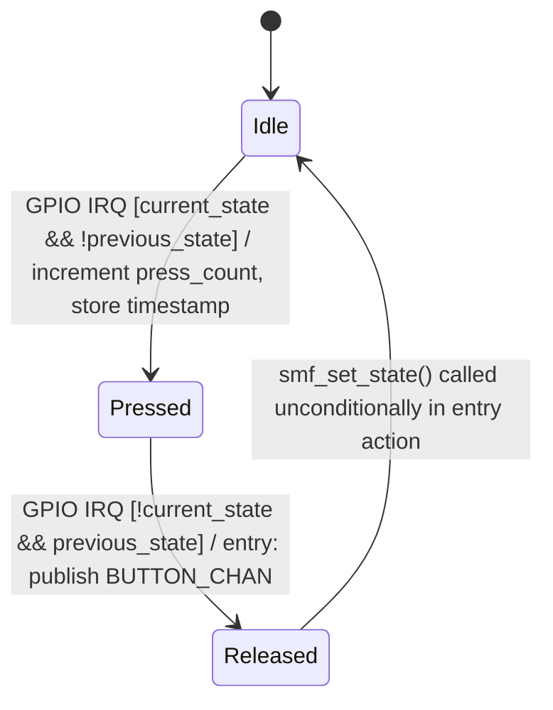

# Button Module Specification

## Document Information

| Field | Value |
|-------|-------|
| Project | nordic-wifi-memfault |
| Version | 2026-08-20-11-02 |
| PRD Version | 2026-08-20-10-59 |
| NCS Version | v2.6.4 |
| Target Board(s) | nRF7002DK |
| Status | Implemented |

> `Version` = this spec's own latest edit time (`date +%Y-%m-%d-%H-%M`); bump it on **every** edit.
> `PRD Version` = the PRD Changelog timestamp this spec tracks. The two normally **differ** — never set them equal.

---

## Changelog

| Version | Summary of changes |
|---|---|
| 2026-07-13-11-08 | Migrated from `pm/openspec/specs/button-module.md`. Confirmed `CONFIG_BUTTON_LONG_PRESS_MS` is now correctly wired to `BUTTON_LONG_PRESS_THRESHOLD_MS` (fixes the dead-Kconfig finding from the legacy `pm/QA.md` report). Module unchanged in structure since the last spec pass. |
| 2026-08-19-15-30 | Dropped nRF54LM20DK + nRF7002EB II from Target Board(s) — that board has no board definition in NCS v2.6.4 (confirmed absent from `zephyr/boards`, `nrf/boards`, and `modules/hal/nordic` in this SDK tree) and has been removed project-wide; see `1-architecture.md` Changelog for the full removal. No module-specific behavior changed. |
| 2026-08-20-11-02 | Updated to PRD v2026-08-20-10-59: PRD corrected nRF7002DK's physical button count from 4 to 2. Added a note that this module's `DK_BTN3_MSK`/`DK_BTN4_MSK` tracking is dead on this board (those masks never change) and an Open Issue about whether to shrink `BUTTON_COUNT` to 2. |

---

## Overview

The Button module monitors four `DK_BTN*` GPIO masks, detects press/release events per
button using an SMF state machine, and publishes `struct button_msg` on `BUTTON_CHAN` for
`app_memfault` to interpret. It does not itself decide what a press *means* — it only
reports button number, press duration, and cumulative press count.

> **nRF7002DK only has 2 physical buttons** (`button0`/`button1` in
> `nrf5340_cpuapp_common.dts`). The module still tracks all 4 `DK_BTN*` masks and runs 4
> independent state machine instances, but `DK_BTN3_MSK`/`DK_BTN4_MSK` never change on this
> board, so `button_sm[2]`/`button_sm[3]` never leave `Idle` and no `button_number` 3 or 4
> message is ever published — see PRD §2.4 Buttons & LEDs.

---

## Location

- **Path**: `src/modules/button/`
- **Files**: `button.c`, `button.h`, `Kconfig.button`, `CMakeLists.txt`

---

## Module Type

- [x] **Application module** — follows the project's SMF+Zbus architecture pattern.
- [ ] Library wrapper module

---

## Zbus Integration

**Subscribes to**: none.

**Publishes to**: `BUTTON_CHAN`, on every button release.

```c
struct button_msg {
	enum button_msg_type type;  /* BUTTON_RELEASED (BUTTON_PRESSED is defined but not published) */
	uint8_t button_number;      /* 1-4, 1-based DK button index */
	uint32_t duration_ms;       /* time held down */
	uint32_t press_count;       /* cumulative presses for this button since boot */
	uint32_t timestamp;         /* k_uptime_get_32() at release */
};
```

---

## State Machine

Per-button independent state machine (`struct button_sm_object button_sm[4]`), one instance
per `DK_BTN1..4`. All four run the same `button_states[]` table.



**State descriptions:**

| State | Description | Entry action | Exit action |
|-------|-------------|--------------|-------------|
| Idle | No button activity; `button_idle_run` polls `current_state` vs `previous_state` on every GPIO edge | — | — |
| Pressed | Button held down | `button_pressed_entry`: increments `press_count`, records `press_timestamp_ms` | — |
| Released | Transient — publishes the release event then returns to Idle | `button_released_entry`: computes `duration_ms`, publishes `BUTTON_CHAN`, calls `smf_set_state(&button_states[0])` | — |

> Run-to-completion model: one GPIO edge (`has_changed` bit for a given button) triggers exactly
> one `smf_run_state()` call for that button's state machine, from `button_handler()` (a DK
> library GPIO callback context, not a dedicated thread).

---

## Kconfig Flags

| Symbol | Type | Default | Description |
|--------|------|---------|--------------|
| `CONFIG_BUTTON_MODULE` | bool | `y` | Enable the button module |
| `CONFIG_BUTTON_LONG_PRESS_MS` | int | `3000` | Press duration (ms) that other modules (`app_memfault`) treat as a "long press" via `BUTTON_LONG_PRESS_THRESHOLD_MS` |
| `CONFIG_BUTTON_MODULE_LOG_LEVEL_*` | choice | `INF` | Standard Zephyr log-level choice |

---

## API / Public Interface

None. `button.h` declares no public functions beyond the Zbus channel itself
(`extern const struct zbus_channel BUTTON_CHAN;`, declared via `ZBUS_CHAN_DECLARE` by consumers).
All behavior is internal to `button.c`, driven by the DK button GPIO callback.

---

## Error Handling

| Error Condition | Detection | Response |
|----------------|-----------|----------|
| `dk_buttons_init()` fails | Return value checked in `button_module_init` | Log error, `SYS_INIT` returns the error (boot continues per Zephyr `SYS_INIT` semantics — button module simply stays uninitialized) |
| `smf_run_state()` returns negative | Checked in `button_handler` | Log error, no crash — state machine remains in its last state |
| `zbus_chan_pub()` timeout/failure | Return value not checked in `button_released_entry` | Silent — press event is dropped; no retry |

---

## Memory Estimate

| Resource | Value | Notes |
|----------|-------|-------|
| Flash | ~3 KB | Small, single-file module |
| RAM (static) | ~512 B | 4× `struct button_sm_object` (SMF ctx + counters) |
| Stack | N/A | Runs in DK button GPIO callback context, no dedicated thread |

---

## Test Points

| Scenario | UART log expected | Pass condition |
|----------|-------------------|----------------|
| Successful init | `Button module initialized` | Always on boot |
| Button 1 short press | (no direct log in `button.c`; observed via `app_memfault` core: `Button 1 short press: Memfault heartbeat`) | duration_ms < `CONFIG_BUTTON_LONG_PRESS_MS` |
| Button 1 long press | `Stack overflow will now be triggered` (from `app_memfault` core listener) | duration_ms ≥ `CONFIG_BUTTON_LONG_PRESS_MS` |
| Init failure | `Failed to initialize DK buttons: %d` | `dk_buttons_init()` returns non-zero |

---

## Open Issues / TBD

- [ ] `BUTTON_PRESSED` message type is defined in `messages.h` but never published (only `BUTTON_RELEASED` is sent) — confirm this is intentional before adding new consumers that might expect press-start events.
- [ ] No debounce logic beyond the DK library's built-in debounce; no double/triple-click detection.
- [ ] Press counts are not persisted across reboot.
- [ ] `BUTTON_COUNT`/`button_masks[]` track 4 buttons but nRF7002DK only has 2 — decide whether to shrink to `BUTTON_COUNT 2` or keep 4 for forward-compatibility with a future board that has more buttons.

---

## Related Specs

- [1-architecture.md](1-architecture.md) — Zbus channel table
- [app-memfault-module.md](app-memfault-module.md) — interprets `BUTTON_CHAN` events (heartbeat, OTA, crash demos, metrics, trace)

*(Changelog is maintained at the top of this document.)*
