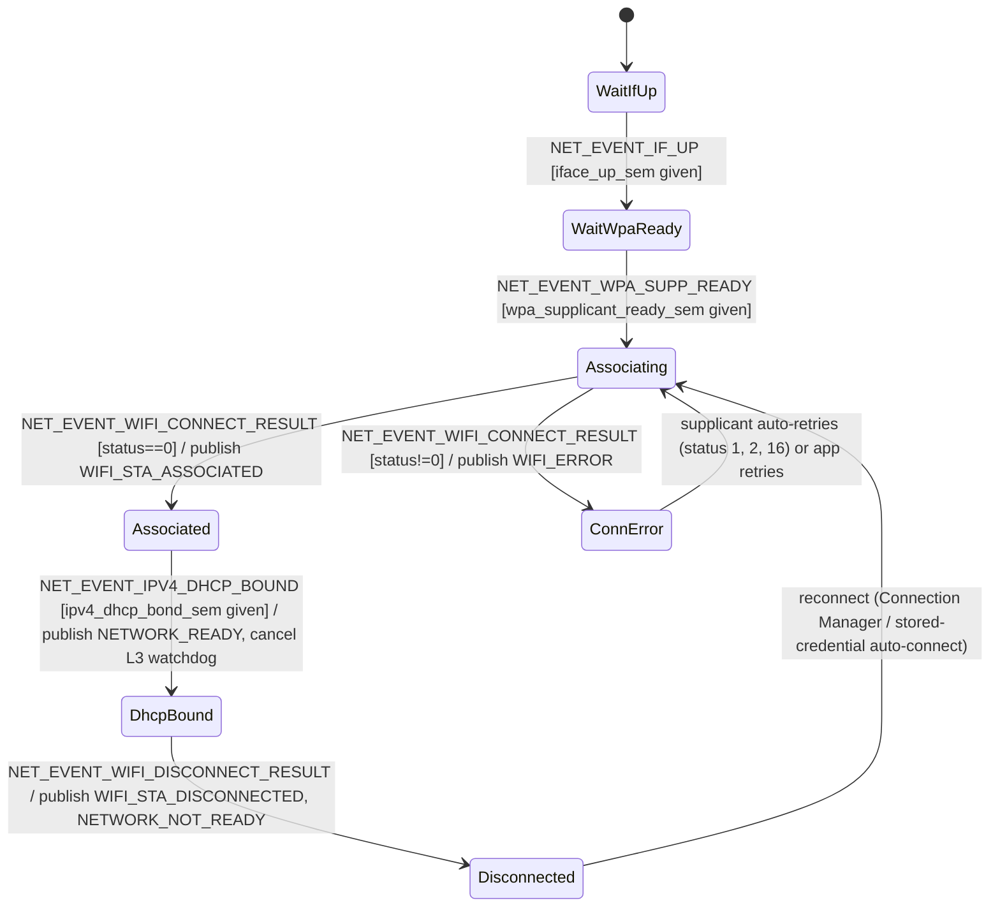

# Network Module Specification

## Document Information

| Field | Value |
|-------|-------|
| Project | nordic-wifi-memfault |
| Version | 2026-08-20-14-10 |
| PRD Version | 2026-08-20-14-10 |
| NCS Version | v2.6.4 |
| Target Board(s) | nRF7002DK |
| Status | Implemented |

> `Version` = this spec's own latest edit time (`date +%Y-%m-%d-%H-%M`); bump it on **every** edit.
> `PRD Version` = the PRD Changelog timestamp this spec tracks. The two normally **differ** — never set them equal.

---

## Changelog

| Version | Summary of changes |
|---|---|
| 2026-08-20-14-10 | **Removed all SoftAP scaffolding** (PRD v2026-08-20-14-10) — this sample only uses Wi-Fi STA mode. Deleted `l2_wifi_softap_event_handler` and its helpers (`get_station_ip_address`, `handle_softap_enable_result`, `handle_station_connected`, `handle_station_disconnected`), the `station_connected_sem`/`softap_mutex`/`connected_stations` state, and the `#if IS_ENABLED(CONFIG_WIFI_NM_WPA_SUPPLICANT_AP)` guard from `net_event_mgmt.c`; deleted `wifi_run_softap_mode()`, `wifi_set_softap()`, `wifi_set_reg_domain()`, `setup_dhcp_server()`, and the unused `wifi_utils_ensure_gateway_softap_credentials()` from `wifi_utils.c`/`.h`; removed the `SoftAP Configuration` Kconfig menu (`SOFTAP_SSID`/`SOFTAP_PASSWORD`/`SOFTAP_CHANNEL`/`SOFTAP_BAND_*`/`SOFTAP_REG_DOMAIN`) from `network/Kconfig`. None of this was ever selectable (`CONFIG_WIFI_NM_WPA_SUPPLICANT_AP` was never enabled), so it never shipped in the built firmware. Build-verified clean on nRF7002DK. |
| 2026-08-20-13-20 | **Zbus event redesign**: `WIFI_CHAN` is now pure L2 (`WIFI_STA_ASSOCIATED` replaces the misleadingly-named `WIFI_STA_CONNECTED`, which actually fired on IP assignment; dead `WIFI_DNS_READY` removed). Added a new publish point for `WIFI_STA_ASSOCIATED` at L2 connect success (previously nothing was published there). `NETWORK_CHAN` (`NETWORK_READY`/`NETWORK_NOT_READY`) is now the sole signal connectivity-gated modules subscribe to — it is no longer a no-subscriber "forward compatibility" channel. Fixed the state diagram, which had been stale/incorrect: it previously showed `WIFI_STA_CONNECTED` published at L2 association, but the actual code only ever published it at DHCP-bound. |
| 2026-07-13-11-08 | Replaces `pm/openspec/specs/wifi-module.md`. The legacy `wifi/wifi.c` module was renamed/split into `network/net_event_mgmt.c` (L2/L3 event handling, Zbus publishing, SoftAP event handlers) and `network/wifi_utils.c` (mode/channel/credential helper functions). The previously-documented 1-second delayed boot connect no longer exists in `net_event_mgmt.c` — connection is now driven purely by Connection Manager / Wi-Fi mgmt events, no artificial startup delay. |
| 2026-07-24-11-30 | Added an L3 DHCP-bound watchdog (`CONFIG_WIFI_MODULE_STA_DHCP_TIMEOUT_SEC`, default 30 s, 0 = disabled), ported from the more complete `zego/bricks/network` reference brick. A successful `NET_EVENT_WIFI_CONNECT_RESULT` only means L2 association succeeded, not that an IP was obtained — without this, a device that associates but never gets a DHCP lease (or loses its lease while still linked) sat "associated, no IP" forever with no recovering event. The watchdog is armed on L2 connect success and on lease loss (`NET_EVENT_IPV4_ADDR_DEL`), cancelled on `NET_EVENT_IPV4_DHCP_BOUND` and `NET_EVENT_WIFI_DISCONNECT_RESULT`; on expiry it issues `NET_REQUEST_WIFI_DISCONNECT`, which produces a `DISCONNECT_RESULT` that re-arms whichever module owns STA reconnect (`wifi_prov_over_ble`). |
| 2026-08-19-15-30 | Dropped nRF54LM20DK + nRF7002EB II from Target Board(s) — that board has no board definition in NCS v2.6.4 and has been removed project-wide; see `1-architecture.md` Changelog for the full removal. No module-specific behavior changed. |

---

## Overview

The `network` module owns all Wi-Fi and IP-layer event handling: registering `net_mgmt`
callbacks for interface (L2), Wi-Fi connect/disconnect (L2), WPA supplicant readiness (L3),
and IPv4/DHCP (L3) events; publishing `WIFI_CHAN` and `NETWORK_CHAN` Zbus events for the
rest of the app; and exposing small Wi-Fi helper utilities (mode/channel setting, credential
auto-connect, TX-injection mode) used by other modules. This sample only uses Wi-Fi STA
mode — it does **not** implement SoftAP or Wi-Fi Direct (see PRD §2.1, §8).

---

## Location

- **Path**: `src/modules/network/`
- **Files**: `net_event_mgmt.c`, `net_event_mgmt.h`, `wifi_utils.c`, `wifi_utils.h`, `Kconfig`, `Kconfig.defaults`, `CMakeLists.txt`

---

## Module Type

- [x] **Application module** — event-driven (not SMF); reacts to `net_mgmt` callbacks rather than a message queue.
- [ ] Library wrapper module

---

## Zbus Integration

**Subscribes to**: none.

**Publishes to**: `WIFI_CHAN` and `NETWORK_CHAN`.

```c
struct wifi_msg {
	enum wifi_msg_type type;  /* WIFI_STA_ASSOCIATED, WIFI_STA_DISCONNECTED, WIFI_ERROR */
	int32_t rssi;              /* not currently populated (always 0) */
	int error_code;
};

struct network_msg {
	enum network_msg_type type;  /* NETWORK_READY, NETWORK_NOT_READY */
	bool ready;
};
```

`WIFI_CHAN` is pure L2 (association-layer) signaling: `WIFI_STA_ASSOCIATED` on successful
association, `WIFI_STA_DISCONNECTED` on L2 disconnect, `WIFI_ERROR` on connect failure. It
currently has no subscribers — reserved for future L2-specific consumers (e.g. RSSI/link
diagnostics).

`NETWORK_CHAN` (`NETWORK_READY`/`NETWORK_NOT_READY`) is the authoritative "safe to do IP
traffic" signal and is what every connectivity-gated module subscribes to (`app_memfault`,
`wifi_prov_over_ble`, `app_https_client`, `app_mqtt_client`, `ntp`, OTA triggers).
`NETWORK_READY` is published on `NET_EVENT_IPV4_DHCP_BOUND`; `NETWORK_NOT_READY` is published
on L2 disconnect (alongside `WIFI_STA_DISCONNECTED`, from the same handler).

---

## State Machine

Not SMF. Event-driven via five `net_mgmt_event_callback` registrations, each masked to a
layer:



**State descriptions:**

| State | Description | Notes |
|-------|-------------|-------|
| WaitIfUp | Waiting for the Wi-Fi network interface to come up | `k_sem` (`iface_up_sem`) given on `NET_EVENT_IF_UP` |
| WaitWpaReady | Waiting for the WPA supplicant to signal readiness | `wpa_supplicant_ready_sem`; NCS v2.6.4 names this event `NET_EVENT_WPA_SUPP_READY` (renamed to `NET_EVENT_SUPPLICANT_READY` in later NCS) |
| Associating | Connection attempt in progress (via `wifi_credentials`/Connection Manager, or triggered by `wifi_prov_over_ble`) | Decodes and logs common WPA status codes (auth failure, AP not found, timeout, etc.) |
| Associated | L2 association succeeded | `wifi_print_status()` called; `WIFI_STA_ASSOCIATED` published on `WIFI_CHAN`; if `CONFIG_WIFI_MODULE_STA_DHCP_TIMEOUT_SEC > 0`, the L3 DHCP-bound watchdog is armed here |
| DhcpBound | IP address assigned | `ipv4_dhcp_bond_sem` given; `NETWORK_READY` published on `NETWORK_CHAN`; L3 watchdog cancelled |
| Disconnected | L2/L4 disconnected | `WIFI_STA_DISCONNECTED` published on `WIFI_CHAN`, `NETWORK_NOT_READY` published on `NETWORK_CHAN`; decodes common 802.11 disconnect reason codes; L3 watchdog cancelled |
| ConnError | Connection attempt failed | `WIFI_ERROR` published with the raw status code |

---

## Kconfig Flags

| Symbol | Type | Default | Description |
|--------|------|---------|--------------|
| `CONFIG_WIFI_MODULE` | bool | `y` | Enable Wi-Fi and network event management |
| `CONFIG_WIFI_MODULE_INIT_PRIORITY` | int | `90` | `SYS_INIT` priority for `init_network_events` |
| `CONFIG_WIFI_MODULE_STA_DHCP_TIMEOUT_SEC` | int (0–300) | `30` (0 = disabled) | L3 connectivity watchdog: forces `NET_REQUEST_WIFI_DISCONNECT` if DHCP hasn't bound this many seconds after L2 association, or a lease is lost while still associated |
| `CONFIG_WIFI_NRF700X` | bool | `y if WIFI_MODULE` | nRF70 driver (named `WIFI_NRF70` in later NCS releases) |
| `CONFIG_WPA_SUPP` | bool | `y if WIFI_MODULE` | nRF wrapper WPA supplicant (NCS v2.6.4 name; Zephyr's `WIFI_NM_WPA_SUPPLICANT` is not used) |
| `CONFIG_WPA_SUPP_THREAD_STACK_SIZE` | int | `8192 if WIFI_MODULE` | WPA supplicant thread stack |
| `CONFIG_WPA_SUPP_WQ_STACK_SIZE` | int | `5632 if WIFI_MODULE` | WPA supplicant workqueue stack |
| `CONFIG_NRF_WIFI_SCAN_MAX_BSS_CNT` | int | `20 if WIFI_MODULE` | Max scan results |
| `CONFIG_NRF700X_RX_NUM_BUFS` | int | `16 if WIFI_MODULE` | RX buffer count |
| `CONFIG_NRF700X_MAX_TX_AGGREGATION` | int | `4 if WIFI_MODULE` | TX aggregation |
| `CONFIG_NRF700X_SR_COEX` | bool | `y if WIFI_MODULE` | Wi-Fi/BLE coexistence |
| `CONFIG_NET_CONNECTION_MANAGER` | bool | `y if WIFI_MODULE` | Connection Manager |
| `CONFIG_NET_CONNECTION_MANAGER_MONITOR_STACK_SIZE` | int | `7168 if WIFI_MODULE` | Sized 1.5× a measured 4572 B (88%) high-water mark |
| `CONFIG_L2_WIFI_CONNECTIVITY` | bool | `n` (forced) | Disabled — combined with this app's Kconfig graph on NCS v2.6.4 it triggers a `net_if.h` macro-expansion bug; `network`'s own manual connect/reconnect logic makes it redundant anyway |

---

## API / Public Interface

```c
/* net_event_mgmt.h */
int init_network_events(void);
bool net_event_mgmt_is_connected(void);
extern struct k_sem iface_up_sem;
extern struct k_sem wpa_supplicant_ready_sem;
extern struct k_sem ipv4_dhcp_bond_sem;

/* wifi_utils.h */
const char *wifi_utils_get_last_ssid(void);
int wifi_utils_auto_connect_stored(void);
int wifi_set_mode(int mode);
int wifi_set_channel(int channel);
int wifi_set_tx_injection_mode(void);
```

---

## Error Handling

| Error Condition | Detection | Response |
|----------------|-----------|----------|
| Wi-Fi connect failure | `NET_EVENT_WIFI_CONNECT_RESULT` with non-zero `status` | Logs decoded reason (auth failure, AP not found, timeout, etc.); publishes `WIFI_ERROR`; supplicant auto-retries on transient codes (1, 2, 16) |
| Wi-Fi disconnect | `NET_EVENT_WIFI_DISCONNECT_RESULT` | Logs decoded 802.11 reason code; publishes `WIFI_STA_DISCONNECTED` and `NETWORK_NOT_READY` |
| Interface not found | `net_if_get_first_wifi()` returns NULL in `wifi_utils.c` helpers | Log error, return `-ENODEV` |
| Invalid channel | `wifi_set_channel()` range check | Log error, return `-EINVAL` |

---

## Memory Estimate

| Resource | Value | Notes |
|----------|-------|-------|
| Flash | ~120 KB | Includes Wi-Fi driver + WPA supplicant link-in triggered by this module's Kconfig selects (not this module's own code size) |
| RAM (static) | ~60 KB | Network buffers, WPA supplicant firmware state |
| Stack | 8192 B (`WPA_SUPP_THREAD_STACK_SIZE`) + 5632 B (`WPA_SUPP_WQ_STACK_SIZE`) + 7168 B (`NET_CONNECTION_MANAGER_MONITOR_STACK_SIZE`) | External-library threads triggered by this module, not this module's own thread (module itself has no dedicated thread) |

---

## Test Points

| Scenario | UART log expected | Pass condition |
|----------|-------------------|----------------|
| Interface up | `[IF] Network interface %s is up` | On `NET_EVENT_IF_UP` |
| Wi-Fi connected | `[WiFi] WiFi is connected!` | `NET_EVENT_WIFI_CONNECT_RESULT` status == 0 |
| Wi-Fi disconnected | `=== WiFi DISCONNECTED (reason: %d) ===` | `NET_EVENT_WIFI_DISCONNECT_RESULT` |
| Connect failure | `[WiFi] Reason: <decoded reason>` | `NET_EVENT_WIFI_CONNECT_RESULT` status != 0 |

---

## Open Issues / TBD

- [ ] `wifi_msg.rssi` is never populated (always 0) — future enhancement per PRD.

---

## Related Specs

- [1-architecture.md](1-architecture.md) — Zbus channel table, boot sequence
- [app-wifi-prov-ble-module.md](app-wifi-prov-ble-module.md) — credential provisioning, consumes `NETWORK_CHAN`
- [app-memfault-module.md](app-memfault-module.md) — consumes `NETWORK_CHAN` for upload-on-connect

*(Changelog is maintained at the top of this document.)*
