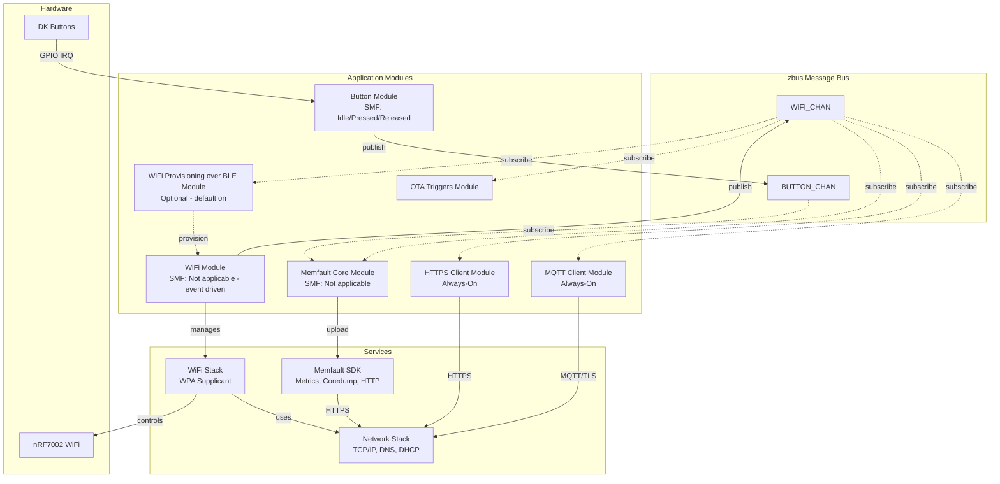
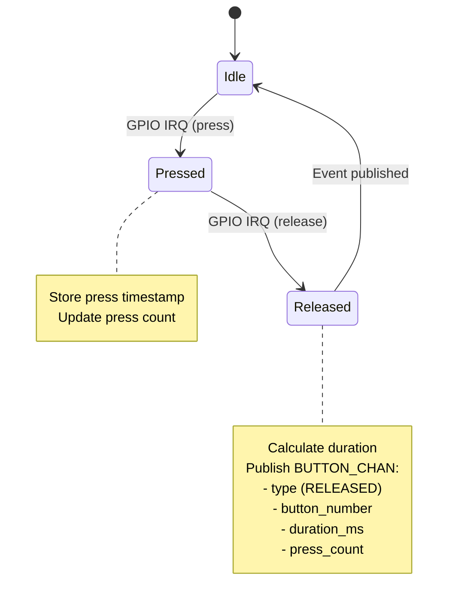
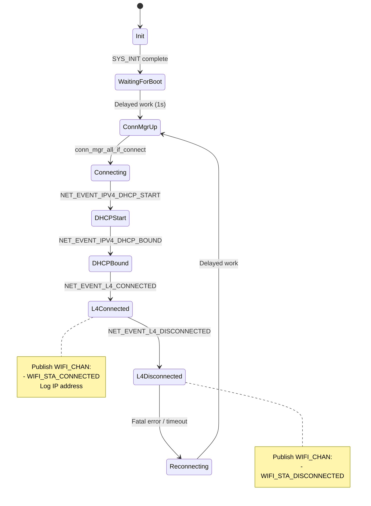
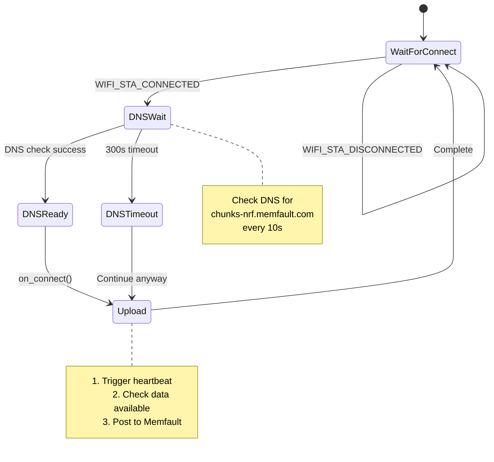
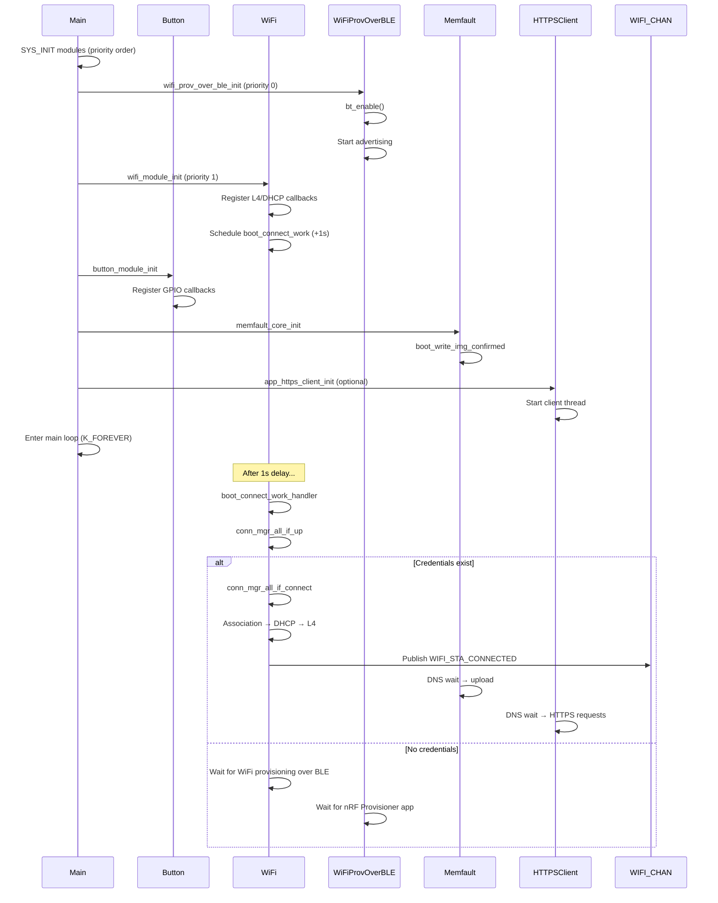
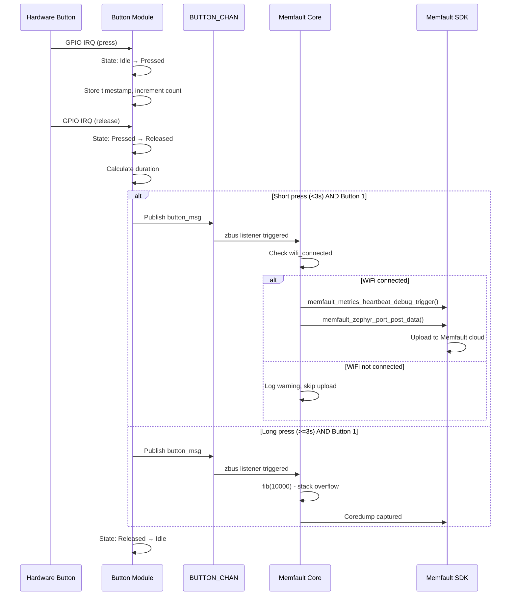
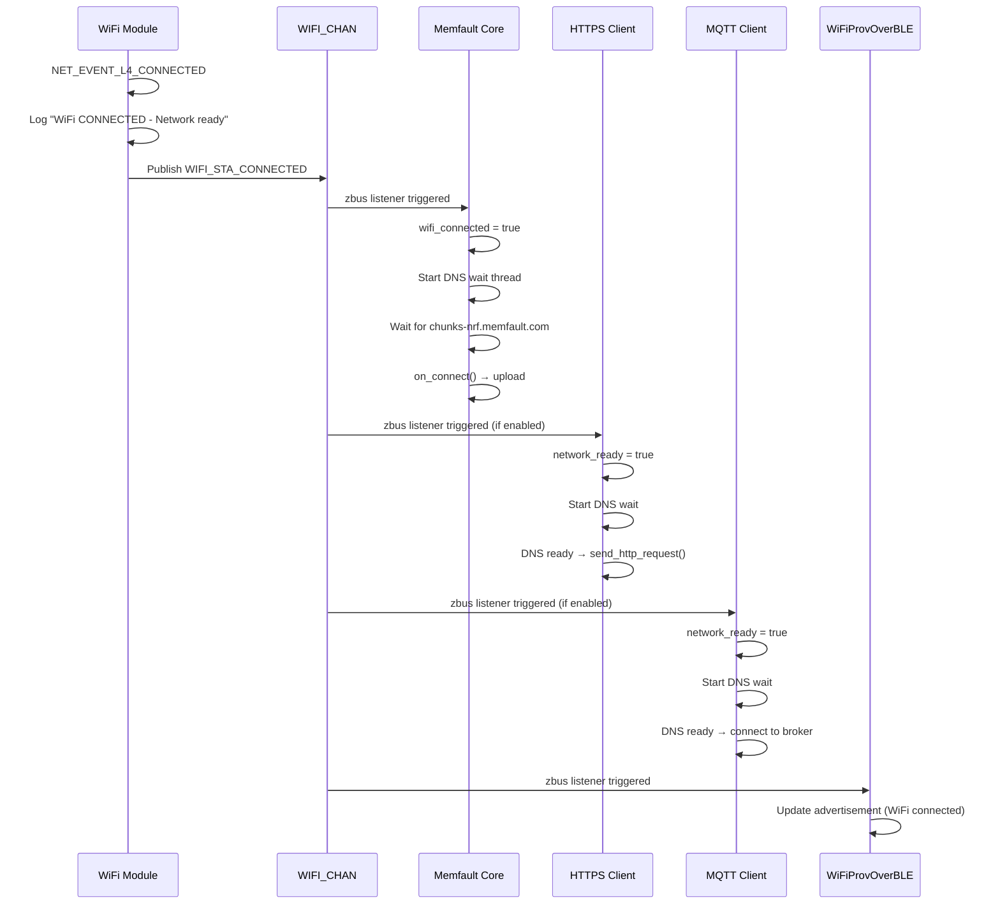

# Product Requirements Document (PRD) – Memfault nRF7002DK

## Document Information

- **Product Name**: Memfault nRF7002DK Sample
- **Product ID**: memfault-nrf7002dk
- **Document Version**: 1.1
- **Date Created**: 2026-02-06
- **Last Updated**: 2026-03-03
- **Status**: Draft
- **Target Release**: Refactoring (dev/refactoring branch)
- **Architecture**: SMF + zbus modular

---

## 1. Executive Summary

### 1.1 Product Overview

Memfault nRF7002DK is a comprehensive Memfault integration sample for Nordic nRF7002DK (nRF5340 + nRF7002 Wi‑Fi). It demonstrates IoT device management with Wi‑Fi STA connectivity, optional WiFi provisioning over BLE, HTTPS/MQTT clients, and cloud-based monitoring via Memfault (crash reporting, metrics, OTA).

### 1.2 Target Users

- **Primary**: Embedded developers integrating Memfault with nRF70 Wi‑Fi devices
- **Secondary**: QA and support teams validating connectivity and OTA flows

### 1.3 Success Metrics

| Metric | Target | Measurement |
|--------|--------|-------------|
| Build | Clean west build for nrf7002dk/nrf5340/cpuapp | CI / local |
| Connectivity | Wi‑Fi STA connect, Memfault upload | Manual/automated |
| OTA | FOTA via Memfault | Manual test |

---

## 2. Product Requirements

### 2.1 Feature Selection

#### Core Wi‑Fi & Network

| Feature | Selected | Config | Description |
|---------|----------|--------|-------------|
| Wi‑Fi STA | ☑ | `CONFIG_WIFI=y`, `CONFIG_WIFI_NM_WPA_SUPPLICANT=y` | Station mode, connect to AP |
| Wi‑Fi Shell | ☐ (board overlay can enable) | `CONFIG_NET_L2_WIFI_SHELL=y` | Shell commands |
| IPv4 | ☑ | `CONFIG_NET_IPV4=y` | IPv4 only |
| TCP/UDP | ☑ | `CONFIG_NET_TCP=y`, `CONFIG_NET_UDP=y` | Required for HTTP/MQTT |
| DNS | ☑ | `CONFIG_DNS_RESOLVER=y` | Memfault/HTTPS/MQTT |
| DHCP Client | ☑ | `CONFIG_NET_DHCPV4=y` | IP assignment |

#### Optional Features (overlays / Kconfig)

| Feature | Selected | Config | Description |
|---------|----------|--------|-------------|
| WiFi Provisioning over BLE | ☑ (default) | `CONFIG_WIFI_STA_PROV_OVER_BLE_ENABLED=y` | Wi‑Fi credentials via nRF Wi‑Fi Provisioner |
| HTTPS Client | ☑ (always-on) | `CONFIG_APP_HTTPS_CLIENT_MODULE=y` | Periodic HTTPS HEAD requests to example.com (300s interval) |
| MQTT Client | ☑ (always-on) | `CONFIG_APP_MQTT_CLIENT_MODULE=y` | TLS-secured MQTT echo test to test.mosquitto.org (300s interval) |
| nRF70 FW Stats CDR | ☑ (default) | `CONFIG_NRF70_FW_STATS_CDR_ENABLED=y` | PHY/LMAC/UMAC stats to Memfault |

#### Cloud & OTA

| Feature | Selected | Config | Description |
|---------|----------|--------|-------------|
| Memfault | ☑ | `CONFIG_MEMFAULT=y` | Crash, metrics, logs, OTA |
| Memfault FOTA | ☑ | `CONFIG_MEMFAULT_FOTA=y` | OTA via Memfault |
| MCUBoot | ☑ | sysbuild | Dual-bank, rollback |

#### State Management & Architecture

| Feature | Selected | Config | Description |
|---------|----------|--------|-------------|
| SMF | ☑ | `CONFIG_SMF=y` | State Machine Framework |
| Zbus | ☑ | `CONFIG_ZBUS=y` | Message bus between modules |

### 2.2 Functional Requirements (Summary)

- **FR-001**: Device connects to Wi‑Fi (STA) using stored or WiFi-over-BLE provisioned credentials.
- **FR-002**: On L4 connected, Memfault data (heartbeat, coredump, CDR) uploads after DNS ready.
- **FR-003**: Button 1 short press: trigger heartbeat + optional nRF70 CDR; long press: stack overflow (demo).
- **FR-004**: Button 2 short press: OTA check; long press: division-by-zero (demo).
- **FR-005**: Optional WiFi provisioning over BLE for Wi‑Fi credentials; HTTPS and MQTT client modules are always-on and react to Wi‑Fi state via zbus (WIFI_CHAN).

### 2.3 Architecture

#### 2.3.1 Architecture Pattern Selection

| Pattern | Selected | Description | Best For |
|---------|----------|-------------|----------|
| Simple Multi-Threaded | ☐ | Traditional threads with direct communication (queues, semaphores) | Simple applications, quick prototypes, 1-3 modules |
| SMF + zbus Modular | ☑ | State machines with message-based communication | Complex applications, scalable systems, 4+ modules |

**Selected Pattern**: SMF + Zbus Modular Architecture

**Justification**:
- Provides loose coupling between modules for better maintainability
- Demonstrates professional architecture patterns for production IoT systems
- Enables easy addition of new modules (HTTPS, MQTT, BLE) without affecting core functionality
- Message-based communication simplifies testing and debugging
- State machines provide clear, verifiable behavior for connectivity flows

**Trade-offs**:
- **Pros**:
  - Highly maintainable and testable
  - Clear separation of concerns
  - Easy to add/remove optional features (BLE, HTTPS, MQTT)
  - Industry best practice for embedded IoT systems
  - Simplifies concurrent operations (WiFi + Memfault + optional clients)

- **Cons**:
  - Slightly higher overhead (~10 KB) vs simple threading
  - Requires understanding of SMF and zbus concepts
  - More initial setup complexity

#### 2.3.2 System Architecture



**Description**: Modular architecture with State Machine Framework (SMF) for button behavior and Zbus for inter-module communication. Each module operates independently and communicates through well-defined message channels. WiFi connectivity state drives optional modules (HTTPS, MQTT, WiFi provisioning over BLE status updates).

#### 2.3.3 Module Descriptions

**Module 1: Button Module**
- **Purpose**: Monitor DK button states, detect presses/releases, maintain press counts
- **Inputs**: GPIO interrupts from 4 hardware buttons
- **Outputs**: Button events via BUTTON_CHAN (pressed/released/count/duration)
- **State Machine**: 3 states (Idle → Pressed → Released → Idle)
- **Dependencies**: DK Library (GPIO), Zbus
- **Files**: `src/modules/button/button.c`, `button.h`, `Kconfig.button`
- **Key Behaviors**:
  - Short press (Button 1): Trigger Memfault heartbeat + optional nRF70 CDR collection
  - Long press (Button 1, >3s): Stack overflow demo
  - Short press (Button 2): Schedule Memfault OTA check
  - Long press (Button 2, >3s): Division-by-zero demo
  - Buttons 3 & 4: Increment metrics and trace events

**Module 2: WiFi Module**
- **Purpose**: Manage WiFi STA lifecycle (connect, monitor, error handling)
- **Inputs**: Network management events, stored credentials or WiFi provisioning over BLE
- **Outputs**: WiFi status via WIFI_CHAN (connected/disconnected)
- **State Machine**: Event-driven (not SMF) - reacts to NET_EVENT_L4_CONNECTED/DISCONNECTED
- **Dependencies**: WiFi driver, WPA Supplicant, Connection Manager, Zbus
- **Files**: `src/modules/wifi/wifi.c`, `wifi.h`
- **Key Behaviors**:
  - Delayed boot connect (1s after SYS_INIT) to ensure subsystems ready
  - L4 event handler publishes WIFI_STA_CONNECTED/DISCONNECTED
  - DHCP event logging with IP address display
  - Reconnect on fatal error or timeout

**Module 3: Memfault Core Module**
- **Purpose**: Handle Memfault connectivity state, DNS wait, upload on connect, heartbeat collection
- **Inputs**: BUTTON_CHAN (heartbeat trigger), WIFI_CHAN (connection state)
- **Outputs**: Memfault SDK calls, connectivity state changes
- **State Machine**: Not SMF - uses zbus listeners + upload thread
- **Dependencies**: Memfault SDK, Zbus, DNS resolver
- **Files**: `src/modules/memfault/core/memfault_core.c`, `memfault_core.h`
- **Key Behaviors**:
  - On WIFI_STA_CONNECTED: signal connectivity started, wait for DNS, trigger upload
  - DNS wait (chunks-nrf.memfault.com) with 300s timeout
  - On button short press: trigger heartbeat + post data
  - On button long press: crash demos (stack overflow, div-by-zero)
  - Boot image confirmation, log level setup

**Module 4: Memfault OTA Triggers Module**
- **Purpose**: Schedule OTA checks on network connect and button press
- **Inputs**: WIFI_CHAN (connection), BUTTON_CHAN (button 2 short press)
- **Outputs**: OTA check via Memfault SDK
- **Dependencies**: Memfault SDK, Zbus
- **Files**: `src/modules/memfault/ota/ota_triggers.c`

**Module 5: WiFi Provisioning over BLE Module (Optional)**
- **Purpose**: Provide WiFi credentials via nRF Wi-Fi Provisioner mobile app
- **Inputs**: BLE connection, WiFi provisioning service
- **Outputs**: WiFi credentials to settings, BLE advertisement updates via WIFI_CHAN
- **State Machine**: Not SMF - uses BLE callbacks and delayed work
- **Dependencies**: Bluetooth stack, WiFi provisioning service, Zbus
- **Files**: `src/modules/wifi_prov_over_ble/wifi_prov_over_ble.c`, `wifi_prov_over_ble.h`
- **Enabled**: `CONFIG_WIFI_STA_PROV_OVER_BLE_ENABLED=y` (default in board conf)

**Module 6: HTTPS Client Module (Always-On)**
- **Purpose**: Periodic HTTPS HEAD requests to example.com for connectivity testing
- **Inputs**: WIFI_CHAN (connection state)
- **Outputs**: HTTPS requests, Memfault metrics (`app_https_req_total_count`, `app_https_req_fail_count`)
- **Dependencies**: TLS, HTTP client, Zbus
- **Files**: `src/modules/app_https_client/app_https_client.c`
- **Enabled**: `CONFIG_APP_HTTPS_CLIENT_MODULE=y` (set in `prj.conf` — always-on)
- **Interval**: 300 s (configurable via `CONFIG_APP_HTTPS_REQUEST_INTERVAL_SEC`)

**Module 7: MQTT Client Module (Always-On)**
- **Purpose**: TLS-secured MQTT echo test to test.mosquitto.org:8883
- **Inputs**: WIFI_CHAN (connection state)
- **Outputs**: MQTT pub/sub, Memfault metrics (`app_mqtt_echo_total_count`, `app_mqtt_echo_fail_count`)
- **Dependencies**: MQTT library, TLS, Zbus
- **Files**: `src/modules/app_mqtt_client/app_mqtt_client.c`
- **Enabled**: `CONFIG_APP_MQTT_CLIENT_MODULE=y` (set in `prj.conf` — always-on)

#### 2.3.4 Zbus Channels

**BUTTON_CHAN**

**Type**: `struct button_msg`

**Fields**:
```c
struct button_msg {
    enum button_msg_type type;  // BUTTON_PRESSED or BUTTON_RELEASED
    uint8_t button_number;       // 1-4
    uint32_t duration_ms;        // Press duration
    uint32_t press_count;        // Total presses since boot
    uint32_t timestamp;          // k_uptime_get_32()
};
```

**Publishers**: Button Module
**Subscribers**: Memfault Core Module

---

**WIFI_CHAN**

**Type**: `struct wifi_msg`

**Fields**:
```c
struct wifi_msg {
    enum wifi_msg_type type;  // WIFI_STA_CONNECTED, WIFI_STA_DISCONNECTED, WIFI_ERROR
    int32_t rssi;             // Signal strength (future)
    int error_code;           // Error code (if applicable)
};
```

**Publishers**: WiFi Module
**Subscribers**: Memfault Core, WiFi Provisioning over BLE, HTTPS Client, MQTT Client, OTA Triggers

#### 2.3.5 State Machines

**Button Module State Machine**:


**WiFi Module Event Flow** (not SMF, event-driven):


**Memfault Core Upload Flow** (not SMF):


#### 2.3.6 Sequence Diagrams

**Startup Sequence**:


**Button Press → Memfault Heartbeat Flow**:


**WiFi Connect → Optional Clients Activate Flow**:


### 2.4 Hardware

- **Target**: nRF7002DK (nRF5340 + nRF7002).
- **Memory**: See boards/nrf7002dk_nrf5340_cpuapp.conf (heap, TLS, etc.).

### 2.5 Build & Workspace

- **Workspace**: `west.yml` pins `sdk-nrf` to v3.2.1; app path `memfault-nrf7002dk`.
- **Build**: `west build -p -b nrf7002dk/nrf5340/cpuapp -- -DEXTRA_CONF_FILE="overlay-app-memfault-project-info.conf"`. HTTPS and MQTT clients are always-on; no separate overlay needed.
- **Project Key**: Copy `overlay-app-memfault-project-info.conf.template` → `overlay-app-memfault-project-info.conf` and set your Memfault project key.

---

## 3. Quality Assurance

- **Definition of Done**: All P0 features implemented, build passes, no hardcoded credentials, README and PRD updated.
- **Test**: Wi‑Fi connect, Memfault upload, button actions, WiFi-over-BLE provisioning, HTTPS client, MQTT client.
- **Kconfig pattern**: `APP_MEMFAULT_MODULE` uses `select MEMFAULT` (not `depends on`). Users no longer need an explicit `CONFIG_MEMFAULT=y` in `prj.conf`.

---

## 4. References

- [NCS Documentation](https://developer.nordicsemi.com/nRF_Connect_SDK/doc/latest/nrf/index.html)
- [Memfault Documentation](https://docs.memfault.com)
- Project README.md and plan (modular refactoring).
