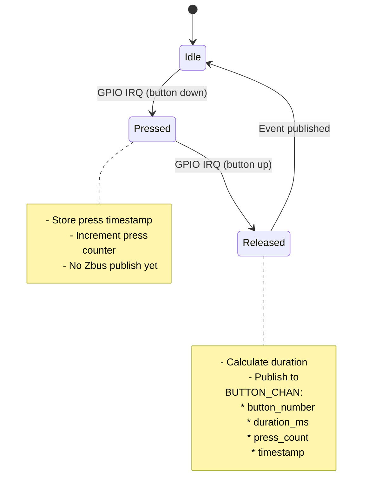

# Button Module Specification

## Overview

The Button module monitors hardware buttons on the nRF7002DK, detects press/release events, and publishes button messages via Zbus. Uses SMF (State Machine Framework) for state management.

## Location

- **Path**: `src/modules/button/`
- **Files**: `button.c`, `button.h`, `Kconfig.button`, `CMakeLists.txt`

## Features

- Monitor 4 hardware buttons (DK buttons 1-4)
- Detect press and release events
- Track press duration (milliseconds)
- Count total presses per button (since boot)
- Distinguish short (<3s) vs long (≥3s) presses
- Publish button events via `BUTTON_CHAN` Zbus channel

## State Machine



**States**:
- `IDLE`: No button activity
- `PRESSED`: Button currently held down
- `RELEASED`: Button just released, publishing event

**Transitions**:
- `Idle → Pressed`: GPIO interrupt (button press detected)
- `Pressed → Released`: GPIO interrupt (button release detected)
- `Released → Idle`: Event published to Zbus

## Zbus Integration

**Channel**: `BUTTON_CHAN`  
**Message Type**: `struct button_msg`

```c
struct button_msg {
    enum button_msg_type type;  // BUTTON_RELEASED
    uint8_t button_number;       // 1-4
    uint32_t duration_ms;        // Time button was held
    uint32_t press_count;        // Total presses since boot
    uint32_t timestamp;          // k_uptime_get_32()
};
```

**Publisher**: Button Module  
**Subscribers**: Memfault Core Module (reacts to button actions)

## Button Actions

| Button | Press Type | Duration | Action | Handler |
|--------|-----------|----------|--------|---------|
| Button 1 | Short | <3s | Trigger Memfault heartbeat + nRF70 stats CDR | Memfault Core |
| Button 1 | Long | ≥3s | Stack overflow crash (demo) | Memfault Core |
| Button 2 | Short | <3s | Check for OTA update | OTA Triggers |
| Button 2 | Long | ≥3s | Division by zero crash (demo) | Memfault Core |
| Button 3 | Short | Any | Increment custom metric (demo) | Memfault Core |
| Button 4 | Short | Any | Create trace event (demo) | Memfault Core |

**Note**: Button module publishes events; Memfault Core module interprets and acts on them.

## Initialization

**Method**: `SYS_INIT`  
**Priority**: After WiFi module (priority 2)  
**Init Function**: `button_module_init()`

**Setup**:
1. Initialize SMF state machine
2. Configure GPIO interrupts for all 4 buttons
3. Register GPIO callbacks
4. Set initial state to `IDLE`

## Dependencies

**Kconfig**:
- `CONFIG_DK_LIBRARY=y` - Nordic DK button/LED library
- `CONFIG_GPIO=y` - GPIO driver
- `CONFIG_SMF=y` - State Machine Framework
- `CONFIG_ZBUS=y` - Zbus messaging

**Modules**:
- None (standalone, publisher only)

## Memory Footprint

- **Flash**: ~3 KB
- **RAM**: ~512 bytes (state machine + GPIO handlers)

## Testing

### Build Test
```bash
west build -b nrf7002dk/nrf5340/cpuapp -p
```

### Runtime Test
1. Flash firmware
2. Monitor UART logs
3. Press each button:
   - Short press: Verify log and press count increment
   - Long press (buttons 1/2): Verify crash demo triggers
4. Verify Memfault metrics on dashboard (button press counts)

### Expected Logs
```
[button] Button 1 pressed (count: 1)
[button] Button 1 released (duration: 250 ms)
[button] Publishing button event: btn=1, dur=250ms, count=1
[memfault_core] Button 1 short press - triggering heartbeat
```

## Known Limitations

- No debouncing (relies on DK library's built-in debounce)
- Press count resets on reboot (not persisted to flash)
- No distinction between single/double/triple clicks
- Max 4 buttons (hardware limitation)

## Future Enhancements

- Persistent press counters (settings storage)
- Configurable long-press threshold (Kconfig)
- Double-click detection
- Button combination support (e.g., Button 1+2 together)

## Related Specs

- [architecture.md](architecture.md) - SMF + Zbus pattern
- [memfault-integration.md](memfault-integration.md) - Button action handlers
