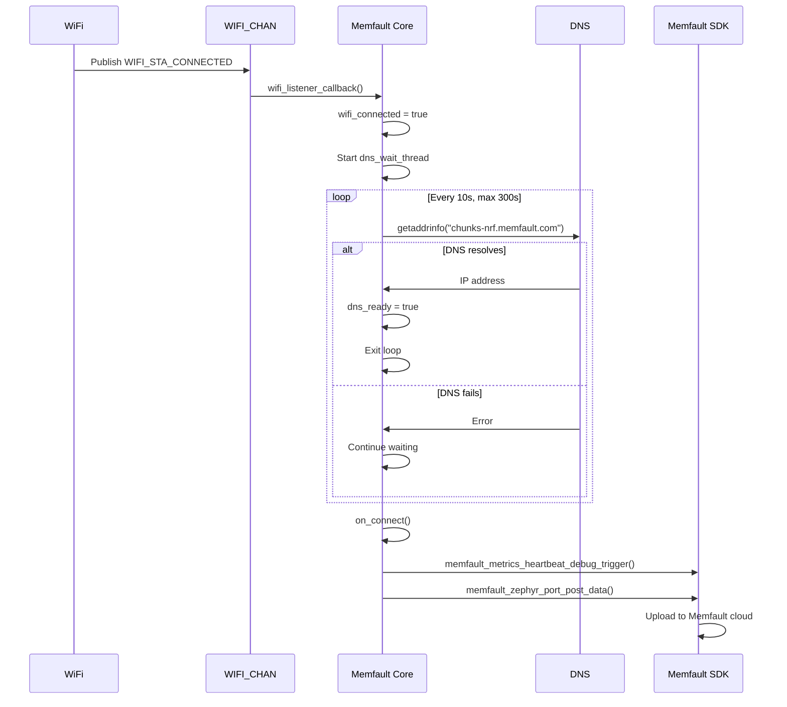
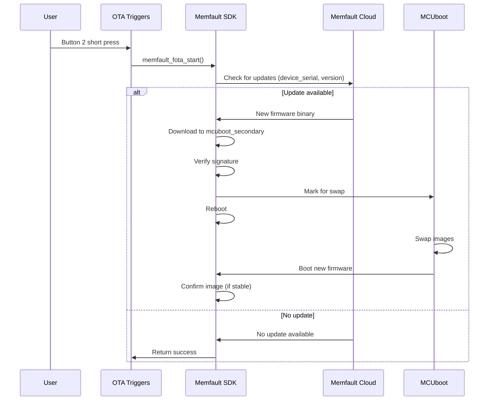

# Memfault Integration Specification

## Overview

The Memfault integration provides cloud-based device monitoring, crash reporting, metrics collection, and OTA firmware updates via the Memfault SDK.

## Location

- **Path**: `src/modules/memfault/`
- **Subdirectories**:
  - `core/` - Upload, heartbeat, boot confirm
  - `metrics/` - WiFi + stack metrics
  - `ota/` - OTA triggers
  - `cdr/` - nRF70 firmware stats Custom Data Recording
  - `config/` - Metrics definitions

## Features

### Core Features

- **Crash Reporting**: Automatic coredump collection and upload
- **Metrics Collection**: WiFi stats, heap, stack usage, CPU temp, custom counters
- **Trace Events**: Button presses, WiFi events, errors
- **Reboot Tracking**: Reboot reason analysis
- **OTA Updates**: Secure firmware updates via MCUboot

### Optional Features

- **nRF70 FW Stats CDR**: WiFi diagnostics (PHY/LMAC/UMAC) via Custom Data Recording
- **WiFi Vendor Detection**: AP OUI → vendor name mapping

## Architecture

```
memfault/
├── core/
│   ├── memfault_core.c       # Upload, heartbeat, button/wifi listeners
│   └── memfault_core.h
├── metrics/
│   ├── memfault_metrics.c    # WiFi + stack metrics collection
│   └── memfault_metrics.h
├── ota/
│   ├── ota_triggers.c        # OTA check triggers (button, WiFi, timer)
│   └── ota_triggers.h
├── cdr/
│   ├── mflt_nrf70_fw_stats_cdr.c  # nRF70 stats CDR
│   └── mflt_nrf70_fw_stats_cdr.h
└── config/
    └── memfault_metrics_heartbeat_config.def  # Metrics definitions
```

## Memfault Core Module

### Responsibilities

1. **Connectivity Management**:
   - Listen to `WIFI_CHAN` for connection state
   - Wait for DNS resolution before uploads
   - Trigger uploads on WiFi connect

2. **Button Event Handling**:
   - Listen to `BUTTON_CHAN` for button actions
   - Short press Button 1: Trigger heartbeat + nRF70 stats CDR
   - Long press Button 1: Stack overflow crash demo
   - Short press Button 3: Increment metric
   - Short press Button 4: Create trace event
   - Long press Button 2: Division by zero crash demo

3. **Boot Management**:
   - Confirm MCUboot image on successful boot
   - Set log levels for debugging

### DNS Wait Flow



**Why DNS Wait?**
- Prevents early upload failures (DNS not ready)
- Reduces unnecessary retries
- Configurable timeout (300s default)
- Uploads proceed even if DNS slow

### Zbus Integration

**Subscribed Channels**:

1. **WIFI_CHAN**:
   - `WIFI_STA_CONNECTED` → Start DNS wait, trigger upload
   - `WIFI_STA_DISCONNECTED` → Mark disconnected

2. **BUTTON_CHAN**:
   - Button 1 short → Heartbeat + nRF70 stats CDR
   - Button 1 long → Stack overflow crash
   - Button 2 long → Division by zero crash
   - Button 3 short → Increment `button_press_count` metric
   - Button 4 short → Create trace event

## Metrics Collection

### Collected Metrics

| Metric | Type | Description | Update Frequency |
|--------|------|-------------|------------------|
| `wifi_rssi` | Gauge | Signal strength (dBm) | Every heartbeat (15 min) |
| `wifi_sta_channel` | Gauge | WiFi channel (1-13) | Every heartbeat |
| `wifi_sta_beacon_interval` | Gauge | Beacon interval (ms) | Every heartbeat |
| `wifi_sta_dtim_period` | Gauge | DTIM period | Every heartbeat |
| `wifi_sta_twt_setup_count` | Counter | TWT setups | Every heartbeat |
| `wifi_ap_oui_vendor` | String | AP vendor (e.g., "Cisco") | Every heartbeat |
| `heap_free` | Gauge | Free heap (bytes) | Every heartbeat |
| `stack_free_*` | Gauge | Per-thread stack free | Every heartbeat |
| `button_press_count` | Counter | Button 3 presses | On button press |

**Heartbeat Interval**: 900s (15 minutes) in production, ~60s in Developer Mode

### Custom Metrics

Add in `config/memfault_metrics_heartbeat_config.def`:
```c
MEMFAULT_METRICS_KEY_DEFINE(my_counter, kMemfaultMetricType_Unsigned)
```

Record in code:
```c
#include <memfault/metrics/metrics.h>

MEMFAULT_METRIC_SET_UNSIGNED(my_counter, value);
MEMFAULT_METRIC_ADD(my_counter, 1);  // Increment
```

## nRF70 Firmware Stats CDR

**Purpose**: Collect WiFi diagnostics from nRF70 firmware (PHY, LMAC, UMAC stats)

**Trigger**:
- Manual: Button 1 short press
- Programmatic: `mflt_nrf70_fw_stats_cdr_collect()`

**Data Collected**:
- PHY: RSSI, CRC errors, channel stats
- LMAC: TX/RX counters, retries, failures
- UMAC: Event counts, packet stats

**Limitation**: 1 upload per device per 24 hours (Memfault CDR limit)

**Parsing**:
```bash
python3 script/nrf70_fw_stats_parser.py \
  /opt/nordic/ncs/v3.2.1/nrf/modules/lib/nrf_wifi/fw_if/umac_if/inc/fw/host_rpu_sys_if.h \
  ~/Downloads/F4CE36006EB1_nrf70-fw-stats_20251128-111955.bin
```

**Kconfig**: `CONFIG_NRF70_FW_STATS_CDR_ENABLED=y` (default)

## OTA Updates

### OTA Triggers

**Automatic**:
- On WiFi connect (immediate check)
- Every 60 minutes while connected

**Manual**:
- Button 2 short press

### OTA Flow



**Partition Layout**:
- `mcuboot_primary` (internal flash): Current app
- `mcuboot_secondary` (external flash): Downloaded update
- MCUboot swaps images on reboot

**Rollback Protection**: MCUboot automatic rollback if new firmware doesn't confirm

## Configuration

### Kconfig Options

```kconfig
# Core Memfault
CONFIG_MEMFAULT=y
CONFIG_MEMFAULT_HTTP_ENABLE=y
CONFIG_MEMFAULT_ROOT_CERT_STORAGE_NRF9160_MODEM=n

# Metrics
CONFIG_MEMFAULT_METRICS=y

# OTA
CONFIG_MEMFAULT_FOTA=y

# nRF70 Stats CDR (optional)
CONFIG_NRF70_FW_STATS_CDR_ENABLED=y

# Project Key (use overlay)
CONFIG_MEMFAULT_NCS_PROJECT_KEY="<your_key>"
```

### Project Key Setup

**Template**: `overlay-app-memfault-project-info.conf.template`
```properties
CONFIG_MEMFAULT_NCS_PROJECT_KEY="YOUR_PROJECT_KEY_HERE"
```

**Create**: `overlay-app-memfault-project-info.conf` (git-ignored)
```bash
cp overlay-app-memfault-project-info.conf.template overlay-app-memfault-project-info.conf
# Edit with your key from Memfault dashboard
```

**Build**:
```bash
west build -p -b nrf7002dk/nrf5340/cpuapp -- \
  -DEXTRA_CONF_FILE="overlay-app-memfault-project-info.conf"
```

## Memory Footprint

| Component | Flash | RAM |
|-----------|-------|-----|
| Memfault SDK Core | ~80 KB | ~30 KB |
| Metrics | +10 KB | +4 KB |
| OTA | +15 KB | +8 KB |
| nRF70 Stats CDR | +15 KB | +4 KB |
| **Total** | **~120 KB** | **~46 KB** |

**Coredump Storage**: 64 KB (internal flash partition)

## Testing

### Build Test
```bash
west build -b nrf7002dk/nrf5340/cpuapp -p -- \
  -DEXTRA_CONF_FILE="overlay-app-memfault-project-info.conf"
west flash --erase
```

### Runtime Test

1. **Upload Symbol File**:
   - Navigate to Memfault dashboard
   - **Fleet → Symbol Files → Upload**
   - Upload `build/memfault-nrf7002dk/zephyr/zephyr.elf`

2. **Verify Metrics**:
   - Wait 15 minutes (or trigger with Button 1)
   - Check **Fleet → Metrics** for `wifi_rssi`, `heap_free`, etc.

3. **Test Crash Reporting**:
   - Press and hold Button 1 for >3s (stack overflow)
   - Wait for device reboot
   - Check **Issues** tab for new crash

4. **Test OTA**:
   - Update version in `prj.conf` (e.g., `4.1.0` → `4.2.0`)
   - Build and upload symbol + binary
   - Create release in dashboard
   - Press Button 2 (short) or wait for auto-check
   - Verify update downloads and installs

### Expected Logs
```
[memfault_core] Memfault Core initialized
[memfault_core] WiFi connected - starting DNS wait
[memfault_core] DNS check: chunks-nrf.memfault.com resolved
[memfault_core] Triggering on-connect upload
[memfault_core] Button 1 short press - triggering heartbeat
[mflt] Heartbeat triggered
[mflt] Data posted: 1234 bytes
```

## Dependencies

**Kconfig**:
- `CONFIG_MEMFAULT=y` - Memfault SDK
- `CONFIG_HTTP_CLIENT=y` - HTTPS uploads
- `CONFIG_ZBUS=y` - Message bus
- `CONFIG_SETTINGS=y` - Device ID storage
- `CONFIG_BOOTLOADER_MCUBOOT=y` - OTA support

**Modules**:
- WiFi Module (connectivity)
- Button Module (triggers)

## Known Limitations

- CDR: 1 upload per device per 24 hours (Memfault limit)
- Developer Mode: Must enable manually in dashboard for faster uploads
- Symbol files: Must upload after every build (version change)
- External flash: OTA requires MX25R64 (8MB) for `mcuboot_secondary`

## Related Specs

- [architecture.md](architecture.md) - Zbus integration
- [button-module.md](button-module.md) - Button triggers
- [wifi-module.md](wifi-module.md) - WiFi connectivity
