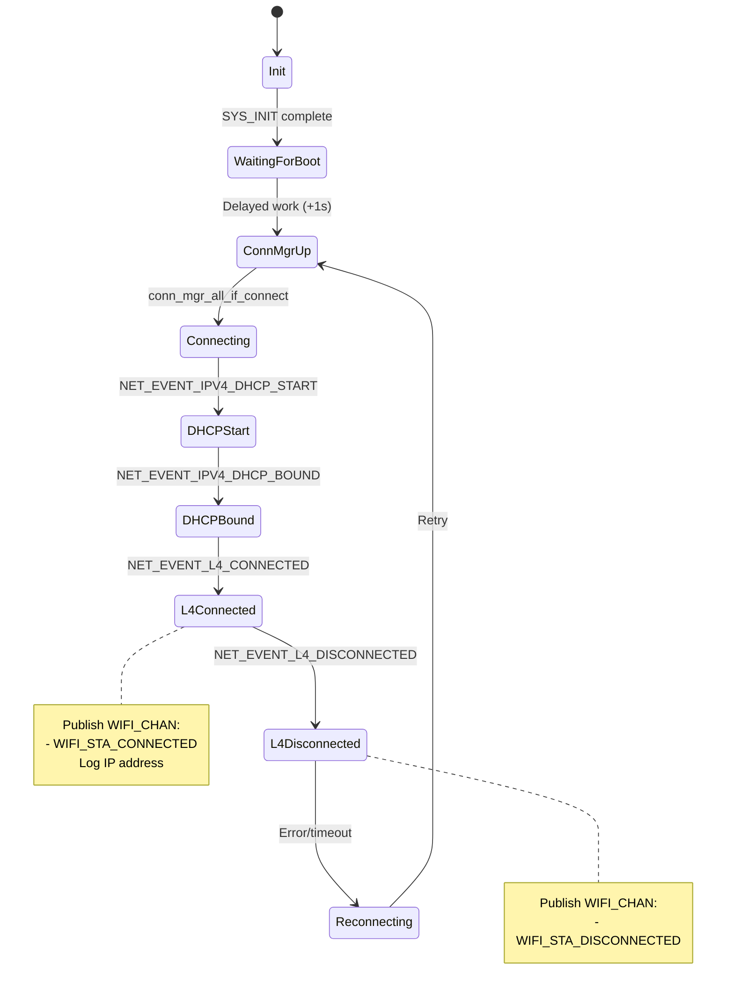
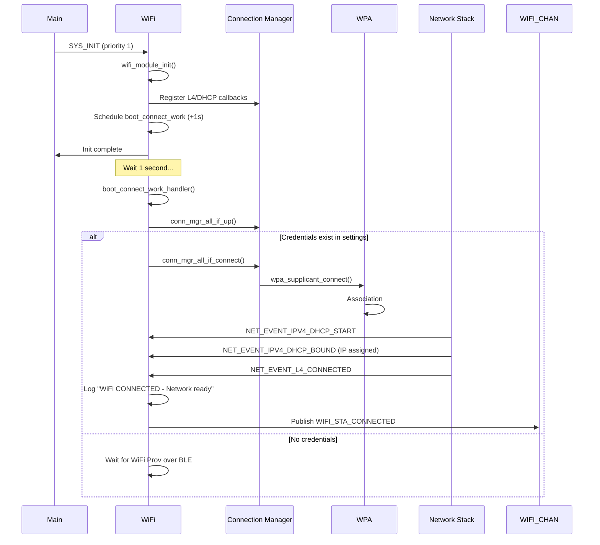

# WiFi Module Specification

## Overview

The WiFi module manages WiFi Station (STA) connectivity lifecycle, including connection, monitoring, error handling, and reconnection. Publishes WiFi status events via Zbus for downstream modules.

## Location

- **Path**: `src/modules/wifi/`
- **Files**: `wifi.c`, `wifi.h`, `Kconfig.wifi`, `CMakeLists.txt`

## Features

- WiFi STA mode connectivity (WPA2/WPA3)
- Automatic boot-time connection (1s delayed)
- DHCP client with IP address logging
- L4 (network layer) event detection
- Automatic reconnection on disconnect/error
- WiFi status publishing via `WIFI_CHAN`
- Integration with Connection Manager

## Event Flow



**Key States**:
- **Init**: Module initialization via SYS_INIT
- **WaitingForBoot**: 1-second delay to ensure subsystems ready
- **Connecting**: Association in progress
- **L4Connected**: Network ready (IP assigned, DNS available)
- **L4Disconnected**: Network lost
- **Reconnecting**: Attempting to reconnect

## Zbus Integration

**Channel**: `WIFI_CHAN`  
**Message Type**: `struct wifi_msg`

```c
struct wifi_msg {
    enum wifi_msg_type type;  // WIFI_STA_CONNECTED, WIFI_STA_DISCONNECTED
    int32_t rssi;             // Signal strength (future)
    int error_code;           // Error details (if applicable)
};
```

**Publisher**: WiFi Module  
**Subscribers**:
- Memfault Core (start DNS wait → upload)
- WiFi Prov over BLE (update advertisement)
- HTTPS Client (start requests)
- MQTT Client (connect to broker)
- OTA Triggers (check for updates)

**Messages**:
- `WIFI_STA_CONNECTED` - Published on `NET_EVENT_L4_CONNECTED` (network ready)
- `WIFI_STA_DISCONNECTED` - Published on `NET_EVENT_L4_DISCONNECTED` (network lost)

## Boot Sequence



## Configuration

**Credentials Storage**: Zephyr settings (persistent storage partition)

**Kconfig Options**:
```kconfig
CONFIG_WIFI=y
CONFIG_WIFI_NM_WPA_SUPPLICANT=y
CONFIG_NET_CONNECTION_MANAGER=y
CONFIG_NET_DHCPV4=y
CONFIG_NET_L2_ETHERNET=y
```

**WiFi Credentials**:
- Stored via WiFi Provisioning over BLE module
- OR manually via shell: `wifi_cred add "<SSID>" 3 "<PSK>"`

## Delayed Boot Connect (1-second)

**Why**: Ensures system readiness before WiFi connection

**Prevents**:
- Early crashes missed by Memfault (SDK not ready)
- BLE advertising conflicts (BLE must start first)
- Incomplete subsystem initialization

**Implementation**: Delayed work queue executed 1 second after SYS_INIT

## Initialization

**Method**: `SYS_INIT`  
**Priority**: 1 (early, before consumers)  
**Init Function**: `wifi_module_init()`

**Setup**:
1. Register Connection Manager callbacks (L4, DHCP)
2. Register network event handlers
3. Schedule delayed boot connect work (1s)
4. Set interface to UP state

## Dependencies

**Kconfig**:
- `CONFIG_WIFI=y` - WiFi support
- `CONFIG_WIFI_NM_WPA_SUPPLICANT=y` - WPA supplicant
- `CONFIG_NET_CONNECTION_MANAGER=y` - Connection manager
- `CONFIG_ZBUS=y` - Message bus
- `CONFIG_SETTINGS=y` - Credential storage

**Hardware**:
- nRF7002 WiFi companion IC
- WiFi Access Point (2.4 GHz, WPA2/WPA3)

## Memory Footprint

- **Flash**: ~120 KB (WiFi stack + WPA supplicant)
- **RAM**: ~60 KB (network buffers, WiFi firmware)

## Testing

### Build Test
```bash
west build -b nrf7002dk/nrf5340/cpuapp -p
```

### Runtime Test

1. **With WiFi Prov over BLE** (default):
   ```
   - Flash firmware
   - Use nRF Wi-Fi Provisioner mobile app
   - Connect to device "PV<MAC>"
   - Select WiFi network, enter password
   - Verify connection in logs
   ```

2. **With Manual Credentials** (shell):
   ```
   uart:~$ wifi_cred add "MySSID" 3 "MyPassword"
   uart:~$ kernel reboot cold
   ```

### Expected Logs
```
[wifi] WiFi module initialized
[wifi] Scheduling boot WiFi connect in 1000ms
[wifi] Connecting to WiFi...
[net_dhcpv4] Received: 192.168.1.100
[wifi] WiFi CONNECTED - Network ready (IP: 192.168.1.100)
[wifi] Publishing WIFI_STA_CONNECTED
```

### Verification
- Check UART logs for "WiFi CONNECTED"
- Verify Memfault data uploads (check dashboard)
- Ping device IP from same network
- Verify optional modules activate (HTTPS/MQTT logs)

## Error Handling

**Scenarios**:
| Error | Behavior |
|-------|----------|
| No credentials | Wait for WiFi Prov over BLE, log warning |
| Association timeout | Retry via Connection Manager |
| DHCP failure | Retry with exponential backoff |
| L4 disconnect | Publish `WIFI_STA_DISCONNECTED`, auto-reconnect |
| Fatal error | Reboot interface, reconnect |

**Logging**: All errors logged at `LOG_ERR` level

## Future Enhancements

- RSSI monitoring (publish in `wifi_msg.rssi`)
- WiFi scan results to Memfault (CDR)
- Power save mode (PSM) support
- 5 GHz support (nRF7002 capable, needs testing)
- WPA3 enterprise support

## Related Specs

- [architecture.md](architecture.md) - Zbus integration
- [wifi-provisioning-ble.md](wifi-provisioning-ble.md) - Credential provisioning
- [memfault-integration.md](memfault-integration.md) - WiFi event subscriber
